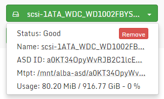
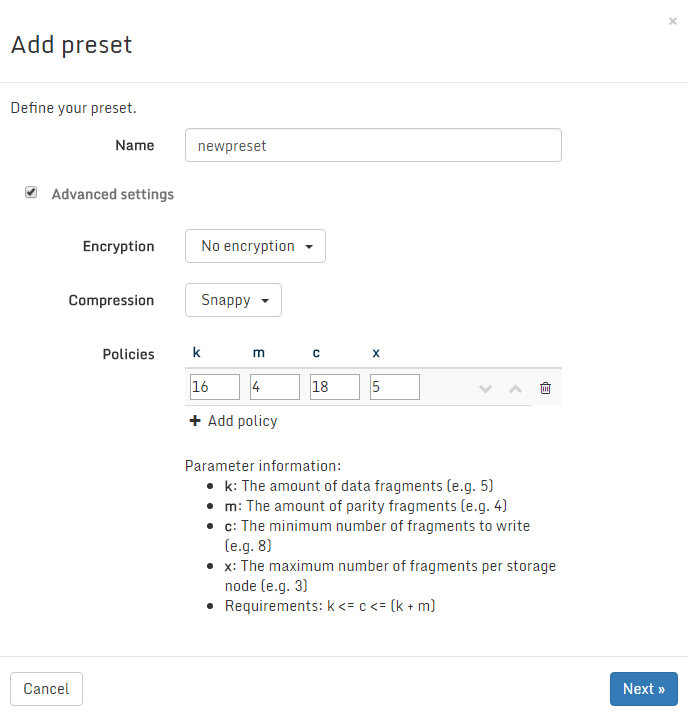

### Backends

#### Introduction

The Open vStorage Backends page allows to configure Open vStorage as Hyperconverged solution by using the disks inside the Storage Router as location for the Tier 2 Storage. You could say that a backend is a group of physical SATA disks which are grouped together. This page is available in case you also installed the backend package during the
installation steps. It is possible to unlock the Open vStorage Backend functionality at any given time by installing the necessary additional packages on every Storage Router. To install the packages execute:

```
apt-get install openvstorage-hc
```


#### Backends Overview

The Backend Overview page displays the different Open vStorage Backends
which are registered in the environment.

For each Backend following details are available:

-   Name: friendly name of the Backend.
-   Type: Type of the Backend. Currently the only supported type as Backend is Open
    vStorage Backend.
-   Status: Status of the Backend. This is indicated by a color.
    -   Green: Everything is ok.
    -   Orange: Issues have been reported which require your attention.
    -   Red: Possible data loss.

#### Backend Actions

##### Add a Backend

-   To add a new Backend to the Open vStorage Cluster, click the **+ Add
    Backend** button.
-   Give the Backend a name. Only the letters a-z, numbers and dashes
    (not as first or last character) are allowed. A minimum of 3 and a
    maximum of 50 characters has to be maintained. Click *Finish* to
    create the Backend.

After creating the Backend, assign some disks to the Backend to store
the actual VM data.

#### Backend Details

The Backend Details page displays the details of a single Backend and
allows to add or remove SATA disks of the Host to the Backend.

Following details are displayed for a Backend:

-   Type: Type of the Backend. Currently the only supported type is Open
    vStorage Backend.
-   Status: Status of the Backend. This is indicated by a color.
    -   Green: Everything is ok.
    -   Orange: Issues have been reported which require your attention.
    -   Red: Possible dataloss.
-   Devices: The amount of disks for each state assigned to the Backend.
    -   Green: The disk is in use by the Backend.
    -   Orange: The disk is in warning state.
    -   Red: The disk is in error.
-   Puts/s: Average amount of puts/s to the Backend over the last 5
    seconds.
-   Gets/s: Average amount of gets/s from the Backend over the last 5
    seconds.

On the right side you can find a pie-chart which displays the storage
Backend consumption per vPool using the Backend.

#### Backend Actions

##### Delete Backend
Delete a backend in case it is no longer in use. Deleting a backend when there are still ASDs attached is not allowed. Remove all ASDs by selecting each ASDk and clicking the *Remove* button on the ASD detail panel.

#### ASD nodes

Under ASD nodes a list of nodes with disks (ASDs)that can be added to
the Backend are shown. By default all nodes with a Storage Router are
shown. Additional nodes can be added by clicking the *Discover* button.

Each disk which can be used as disk for a Backend will be shown. The OS
disk and SSDs will not be shown on the Backend Details page as these can
not be selected to be included in the Backend. Each disks will be
highlighted with a specific color explaining its status:

-   Unavailable (Grey): The disk is already claimed by another Backend.
-   Uninitialized (White): The disk can be claimed to be used in the
    Backend but must first be initialized.
-   Initialized (Light blue): The disk is initialized and will broadcast
    it is ready to be used.
-   Available (Dark blue): The disk is detected by the the Open vStorage
    software as initialized and can now be claimed as Backend disk.
-   Good (Green): The disk is in use by the Backend.
-   Warning (Orange): Disk is in warning state. An action might be
    required.
-   Faulted (Red): Disk is broken and should be replaced. The disks
    needs to be replaced. See the [Replace a broken disk
    section](#broken_disk)

##### Node Actions

There are 2 actions possible available on a node level

-   Initialize all disks: This action will initialize all disks of the
    nide which can be used as Backend disks.
-   Claim all disks: This action will claim all disks which are
    available and will assign them to the Backend.

##### ASD Details and Actions

Each disk (ASD) can be managed individually. Select the dropdown box to
see the ASD details and possible actions. 



##### Replace a broken disk

When a disk is having issues it will be highlighted in orange. You can
try to fix the issue by pressing the *Restart* button in the ASD details
section of that disk. In case the disk is broken and labeled as Faulted,
you can remove the disk from the Backend by clicking the *Remove* button
in the ASD details section. This will remove the disk from the Backend.
You can now safely add a new disk. The new disk will be labeled as
Unitialized (White). The next step is to initialize the disk and once it
becomes available claim the disk.

#### <a name="presets"></a> Presets
A backend has a list of presets assigned to it. A preset consists out of a set of policies and a compression method (optional). A policy defines how the VM data is stored across the ASDs. The easiest way is replication. In that case you only need to set the replication factor. A more advanced policy allows to define the amount of fragments an object is split in, the amount of parity fragments, the minimal amounts of fragments before a write is executed and the maximal amount of fragments per ASD node. Active policies, meaning that objects are using this policy will have a green font color. Available policies which can be used but currently have no object being stored with this policy will be shown in black. In case a policy can not be met, e.g. because there are not enough ASDs or nodes, the policy will be disabled (grey). In case no policy can be met, the backend will be become write-only.

To add a new preset for a backend, click the *+ Add Preset* button. Give the new preset a name. By default you can select the replication factor of fragments stored on the backend. Selecting 1 means that a single broken disk will lead to dataloss.

In case you want to use erasure coding instead of replication, select the advanced settings. Select the checkbox to indicate you understand the risk of adding new policies and the select compression algorithm to use. You will need to add at least one policy. You can also sort the policies according to which policy is more preferred. In case the policy can be met, the top policy will be selected. In case the policy can not be met, the second one from the list gets selected and so forth.




#### Licensing

Under Licensing you will find the active license for the backend. To use
an Open vStorage Backend, a licence is required. You can request a free
license the license section under Administration. Without a valid
license you can not add any physical disks to the backend.
