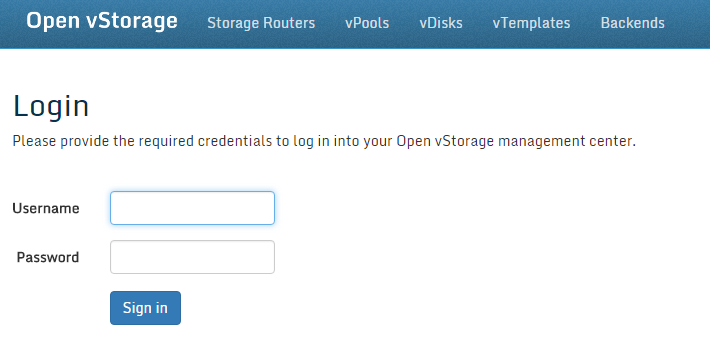
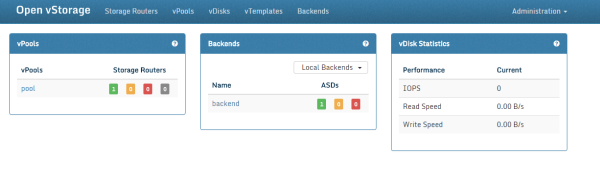

## Using the GUI

An Open vStorge Cluster can be managed through a single web based
interface. The below section will explain how to access and manage an
Open vStorage Cluster through this GUI.

### Log In

The GUI to manage an Open vStorage can be found by navigating with an
HTML5 compatible browsers to the IP address of any of the Storage
Routers in your cluster. In case you use HTTP instead of HTTPS,
the URL will be rewritten to use HTTPS. HTTPS is used to make sure all
the communication between your pc and the Open vStorage Cluster is
secure. When opening the GUI for the first time, you will be presented
with a message about the security certificate. Proceed anyway.

-   You will see the following login screen:

-   Enter your credentials. The default administrator credentials are
    username:**admin**, password:**admin**.
-   Click the **Sign In** button.

When the login was successful, you will be transferred to the Open
vStorage Dashboard.

### The Open vStorage Dashboard

The Open vStorage Dashboard is the default starting point when working
with an Open vStorage Cluster. The Dashboard is a view on the health,
performance and status of the Cluster. unsupported

Following panels, from left to right and top to bottom, can be found on
the Dashboard:

-   vPools: The vPool panel list all the vPools crated in the Open vStorage Cluster. For each vPool a summary of the Storage Routers serving the vPool displayed.
-   Open vStorage Backends (Optional): The Open vStorage Backend panel displays all registered Open vStorage Backends and their status.
-   vDisk Statistics: The vDisk Statistics panels lists the average on
    IOPS, Read and Write Speed and Cache Hits over 5 seconds summarized
    for all vDisks in the Custer. The values are updated automatically
    every 5 seconds.

### The Menu

The top navigation lists following sections:

-   [Storage Routers](storagerouters.md): the Storage Routers running the Open
    vStorage software.
-   [vPools](vpools.md): the available Virtual Storage Pools which can be
    used to deploy vMachines.
-   [vDisks](vdisks.md): the virtual disks served by Open vStorage.
-   [vTemplates](vtemplates.md): the blueprints for a new vDisk.
-   [Backends](backends.md): the Open vStorage Backends.
-   [Administration](administration.md): the administration section.

