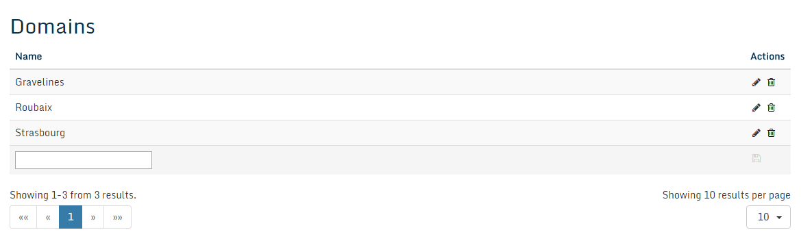
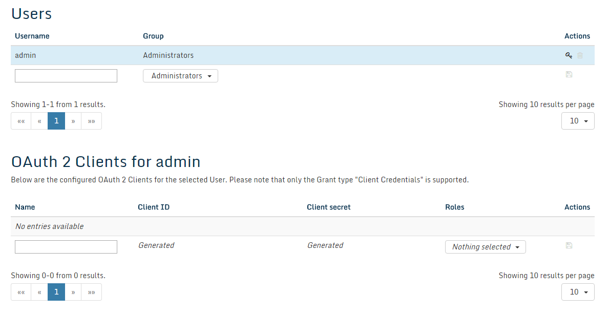
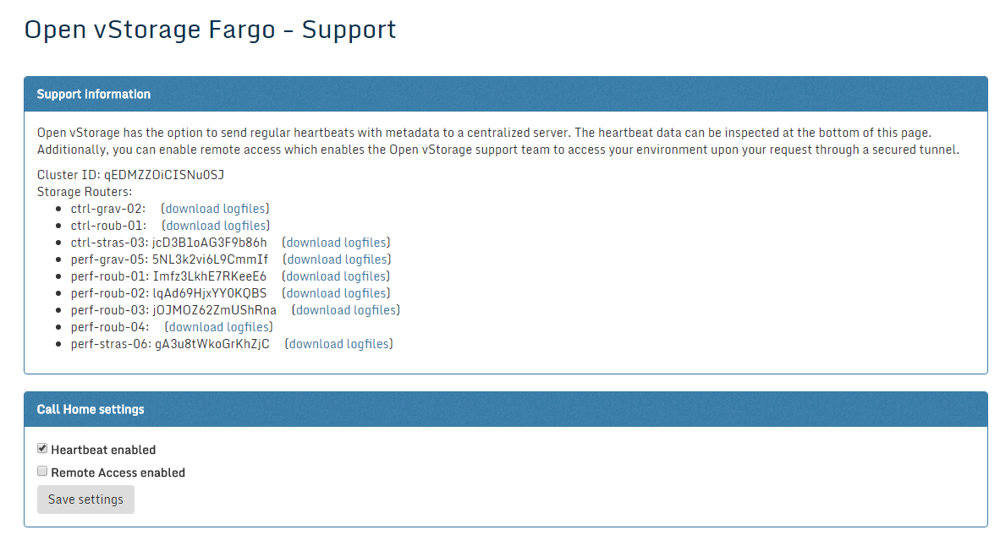

#### Administration

The Administration section acts as the central location to manage and
configure your Open vStorage Cluster.

#### Administrative Actions

Following actions are available for logged in users of the GUI:


#### Domains
The Domains functionality allows to group Storage Routers together and allows to configure the DTL and MDS (MetaDataServer) based upon this grouping. This allows to make sure that when there is a site disaster, the data in the DTL is safeguarded to prevent dataloss.

To add a new Domain, add the name in the textbox and click the save icon.



To assign a Backend to a domain, see the [Backend detail page](backends.md).
To assign a Storage Router to a domain, see the [Storage Router overview page](storagerouters.md).

#### User Management

Under User Mgmt. you get can overview of all the registered users and
OAuth 2 Clients that have access to the Open vStorage environment.



Under Users you get an overview of all the registered users. To add a new user, add
a name in the textbox, select the group and press the save icon to
confirm. There are 2 groups: Administrators and Viewers. Viewers can not
make any changes and have no access to the Administration section.
Administrators can make changes to the Open vStorage environment (f.e.
create new users and vPools) and have access to the Administration
section. It is also possible to limited the access of a user or administrator to a specific backend.
To edit a password of a user, select the key-icon next to the username.

Under the OAuth 2 Clients section, you can see an overview of all
configured OAuth clients for the selected user. By default no OAuth2
client is generated. To add a new client, add a name in the textbox, select the role
and press the check mark. The Client ID and secret token will
automatically be generated.

All user actions and all actions executed by the Open vStorage core are
logged for 30 days. To list all logged actions open an interactive
ipython session from the command line of a Storage Router by typing:

```
ovs
```

In the ipython session execute

```
from ovs.dal.lists.loglist import LogList
for log in LogList.get_logs():
    print log
```

The result for a single entry will look like:

```
{
    "storagedriver_guid": "dcc17681-a157-454e-be7b-a229afddafae",
    "method_args": [],
    "method_kwargs": {
        "storagedriver_id": "local0050569647a1",
        "name": "/test/test.vmx"
    },
    "module": "ovs.lib.vmachine",
    "source": "VOLUMEDRIVER_TASK",
    "time": 1411726920.744713,
    "user_guid": null,
    "guid": "725699e3-e2af-448f-b165-8eecc1e5a491",
    "method": "delete_from_voldrv",
    "metadata": null
}
```

#### Statistics

Under Statistics you get an overview of the load on the framework. The Memcache section displays the
current Memcache, the caching component of the API, activity, its size
in memory and uptime.

#### Support

Under Support you can manage the support options of your Open vStorage
environment and download the log files. When asked by the Open vStorage
Support Team , click the **download logfiles** link and mail the logfiles
of the Open vStorage nodes to the support team. Under the Call Home
section you can enable or disable the heartbeats and whether or not
Remote Access is enabled. Enabling Remote Access will set up a VPN
tunnel between the central datacenter and the individual Open vStorage
environment. This will allow the Open vStorage Support team to remotely
log in and troubleshoot the issue. The content of the heartbeats can be
found under Heartbeat data.

Add the bottom of the page you can find an overview of the important Open vStorage
related websites such as:
* [The Project Website](http://www.openvstorage.com)
* [Commercial support](https://www.openvstorage.com)
* [Community support](https://groups.google.com/forum/#!forum/open-vstorage)
* [The Source Code](https://github.com/openvstorage)



#### Updates
Under updates you can see if there are updates available for the different components of Open vStorage. Click the appropriate button to update the different components.
The Framework can be updated without bringing the vDisks down. A VolumeDriver update requires the vDisks to be stopped or moved to another Storage Router.

**NOTE:** Clicking the **Update Storage Driver** button will stop all vDisks and bring the whole cluster down at once for an update of all nodes. To update an individual node, check the [maintenance instructions](../maintenance/upgrade.md).

#### API

Links to the API of Open vStorage. You can find more info
[here](../usingtheapi/README.md) about how to use the Open vStorage API.

#### Log out

Safely ends the session and logs the current user out of the Open
vStorage GUI.


