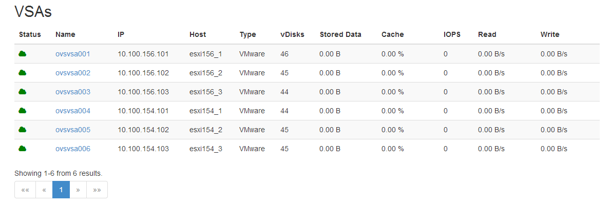
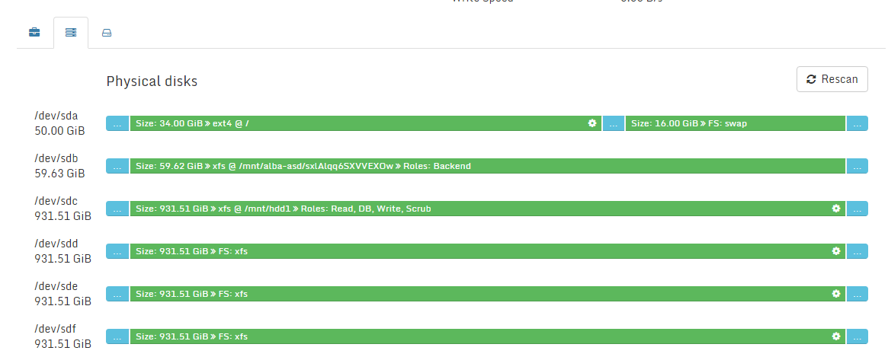

### Storage Routers

#### Introduction

A Storage Router is  running the Open vStorage software. A single Storage Router can host multiple [vPools](vpools.md)
as storage pool for vDisks.

#### Storage Router Overview

The Storage Router overview lists all the Storage Routers in the Open vStorage Cluster.

For each Storage Router following info is displayed:

-   Status: status of the Storage Router. The status can be online (green) or
    offline (red). In case the status is set to online, the Storage Router will be
    able to serve vDisks.
-   Name: Name of the Storage Router. You can click on the name of a Storage Router to see
    [more details](#details) and execute actions.
-   IP: IP address in the Public network of the Storage Router.
-   vDisks: Amount of vDisks served by the Storage Router.
-   Stored Data: The total amount of Stored Data of all vDisks served by
    the Storage Router.
-   IOPS: The current amount of IOPS of all vDisks served by the Storage Router.
-   Read: The aggregated read speed of all vDisks served by the Storage Router.
-   Write: The aggregated write speed of all vDisks served by the Storage Router.
-   Domains: The domains (datacenter, rack, ...) the Storage Router belongs.
-   Recovery Domains: The domain in which the recovery services (DTL, Slave Metadata Server, ...) are hosted.

### Storage Router Details

The Storage Router Details page displays the detailed performance statistics of a
single Storage Router, the actions and allows to configure vPools.

The details for a Storage Router are:

-   IP: IP address in the Public network of the Storage Router.
-   Host: Hostname of the server on which hosts the  Storage Router.
-   Host IP: The Public IP address of the Host.
-   Type: Type of Hypervisor.
-   RDMA Capable: Whether the Storage Router uses RDMA or not for its network communication.
-   SCRUB Capable: Whether the SCRUB role is assigned to the Storage Router.
-   Domains: The domains (datacenter, rack, ...) the Storage Router belongs.
-   Recovery Domains: The domain in which the recovery services (DTL, Slave Metadata Server, ...) are hosted.
-   vPools: Amount of vPools served by the Storage Router.
-   vDisks: Amount of vDisks served by the Storage Router.
-   Stored Data: Total size of the current data and the Snapshots
    without the overhead imposed by the Backend redundancy.
-   IOPS: The current amount of IOPS of all vDisks served by the Storage Router.
-   Read: The aggregated read speed of all vDisks served by the Storage Router.
-   Write: The aggregated write speed of all vDisks served by the Storage Router.

#### Storage Router Actions

##### Edit Storage Router properties
Click the edit button to update the Domain and Recovery Domain. Open vStorage will always run a slave MetaDataServer in the same Domain as configured for the Storage Router. In case a Recovery Domain is configured, an additional slave MetaDataServer will be configured in the Recovery Domain.

##### Mark a Storage Router offline
When a Storage Router is offline, you can mark it offline so it is no longer used. Setting a Storage Router offline is required in order to be able to steal the volumes owned by the Storage Router. Please make sure the Storage Router is actually down and unavailable before marking the Storage Router as offline. Marking the Storage Router as offline while it is still available might lead to data corruption.

##### Refresh the Storage Router properties
The refresh button will refresh the Storage Router properties.

#### Storage Router Administration

##### vPools served by the Storage Router
See which vPools are served by the Storage Router and the ports being used.

#### Physical Disk Management
The Physical Disk Management tab will list all the physical disks (PCIe flash cards, SSDs and SATA drives) of the Storage Router. A physical disks can be assigned different roles:
-   DB: The DB role stores the distributed database and metadata of the volumes. The DB role must be assigned to an SSD. This will reserve 10% of the SSD for the distributed database. Each Storage Router should have one disk with a DB role. Note that this role can't be removed once set.
-   Scrub: The scrubber is the application which does the garbage collection of snapshot data which is out of the retention. This will reserve 300 GB of space. This role is optional but each environment should have at least 1 Storage Router with the Scrub role. Only set the this role on Storage Routers where you want the scrub process to run.
-   Read: This will allow to use the disk as read cache (only required in case the Storage Router is not part of an all flash array or no accelerated ALBA cache layer is used).
-   Write: This will allow to use the disk as write cache.

To assign a role to disk, click the gear icon and select the appropriate roles from the dropdown.
The read and write role can only be removed in case no vPool is using them. The DB and Scrub role can not be removed once assigned to a disk.

**NOTE:** To replace a disk of a Storage Router follow the necessary steps as outlined [here](../maintenance/replacewrite.md).

#### vDisks
The vDisk tab lists all the vDisks being served by the Storage Router. For each vDisk following properties are displayed:
-   Name: Name of the vDisk.
-   Size: Size of the vDisk.
-   Stored Data: Total size of the current data and the Snapshots
    without the overhead imposed by the Backend redundancy.
-   IOPS: The current amount of IOPS delivered by the vPool to the
    vDisk.
-   Read: The current read speed of the vDisk.
-   Write: The current write speed of the vDisk.
-   DTL: Status of the Distributed Transaction Log, a copy of the write buffer of the
    vDisk, on another Storage Router to prevent dataloss. The status can be healthy
    of degraded.
