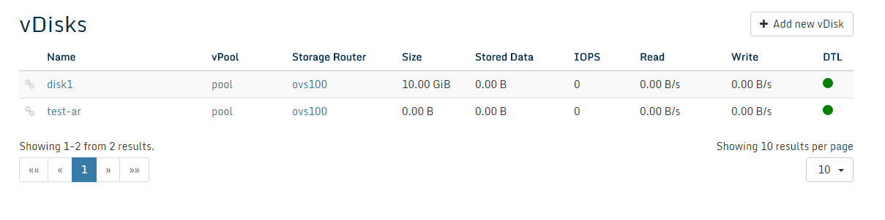
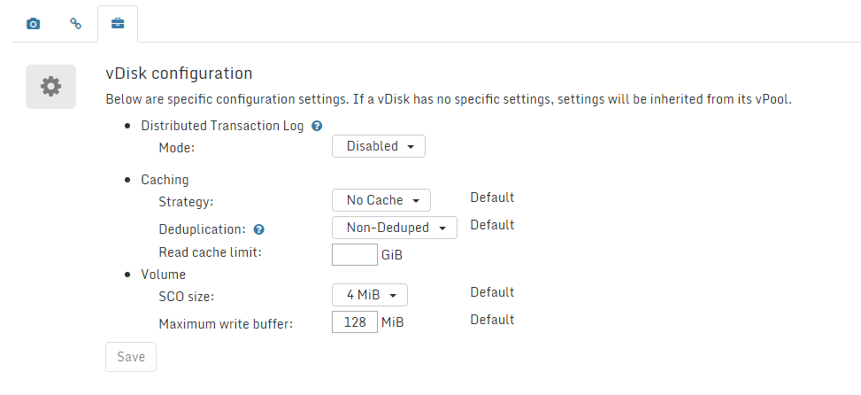

### vDisks

#### Introduction

A vDisks is a virtual disk served by Open vStorage.  By default all vDisks are snapshotted once
per hour. This snapshot schedule can not be changed for the moment.

#### vDisk Overview

The vDisk overview lists all the vDisks in the Open vStorage Cluster.

For each vDisk following info is displayed:
-   Edge connection: Whether the disk is connected through the Edge.
-   Name: Name of the vDisk. You can click on the name of a vDisk to see
    [more details](#vdisk_details) and execute actions.
-   vPool: The vPool the vDisks is stored on.
-   Storage Router: The  Storage Router to which the vDisk connects
    to access its storage.
-   Size: Size of the vDisk.
-   Stored Data: Total size of the current data and the Snapshots
    without the overhead imposed by the Backend redundancy.
-   IOPS: The current amount of IOPS delivered by the vPool to the
    vDisk.
-   Read: The current read speed of the vDisk.
-   Write: The current write speed of the vDisk.
-   DTL: Status of the Distributed Transaction Log, a copy of the write buffer of the
    vDisk, on another Storage Router to prevent dataloss. The status can be healthy
    of degraded.

#### vDisk Actions

##### Create a vDisk
-   Click the **Add new vDisk** button on the vDisk overview page.
-   Give the new vDisks a name, enter a size, select the vPool in which the vDisk should be hosted and select a Storage Router from that vPool. Click **Finish** to create the vDisks.

##### Snapshots

At the bottom of the vDisk Details page all snapshots of the vDisk are
listed.
	
	
### vDisk Details

The vDisk Details page displays the detailed performance statistics of a
single vDisk.

Following information about the vMachine is displayed on the detail
page:

-   vPool: The vPool the vDisks is stored on.
-   Storage Router: The Storage Router to which the vDisk connects to
    access its storage.
-   Size: Size of the vDisk.
-   Stored Data: Total size of the current data and the Snapshots
    without the overhead imposed by the Backend redundancy.
-   \# Snapshots: The amount of snapshots stored of the vDisks.
-   DTL: Status of the Distributed Transaction Log, a copy of the write cache of the
    vDisk, on another Storage Router to prevent data loss. The status can be healthy
    of degraded.
-   Backend location: GUID of the vDisk on the backend.
-   IOPS: The current amount of IOPS delivered by the vPool to the
    vDisk.
-   Read: The current read speed of the vDisk.
-   Write: The current write speed of the vDisk.

#### vDisk Actions

##### Snapshot

Creates a snapshot of the vDisk. Optionally label the snapshot as consist or sticky. Sticky snapshots will not be automatically removed but must be removed manually. 

##### Rollback
Rollback the vDisk and to a previous
snapshot. This action can only be executed on stopped vMachines and the
rollback can not be undone.

##### Clone the vDisk
Cloning a vDisks creates a new vDisk based upon a snapshot of the selected vDisk. Only new data written to the cloned vDisks will be stored on the backend.

##### Move the vDisk
Move the vDisk to another Storage Router of the vPool. This is handy in case you need to update or reboot the Storage Router the vDisks is currently running on.

##### Scrub the vDiks
The scrub action goes over all snapshots and removes data which is overwritten and out of the retention period. By default all vDisks are scrubbed daily but in case this task is disabled, you can manually call the scrub job for a certain vDisk.

##### Set as vTtemplate
Set the vDisk as a Template. A vTemplate allows to create one or more vDisks at once by
cloning a snapshot of the vDisk.

##### Delete the vDisks
The delete button removed the vDisk and all of its snapshots from the cluster. Note that this action can not be undone.

#### Snapshots
The Snapshot tab displays a list of all the snapshots of the vDisk. Per snapshot following properties are displayed:
-   Description: Name or Description of the snapshot.
-   Date/Time: Date and time when the snapshot was created.
-   Stored data: Amount of data in the snapshot which is stored on the Backend.
-   Type: Automatic or Manual snapshot.
-   Consistent: Whether the snapshot is labeled as consistent or not.
-   Sticky: Sticky snapshots can only be manually removed and are not considered to be deleted when out of retention.

Individual Snapshots can be deleted by clicking the delete button.

#### Edge Clients
The Edge Client tab gives an overview of all Edge clients connected to the vDisk. For each client the IP address and client port are provided.

#### Management actions
Under Management actions you can define the settings for the vDisk:
-   Distributed Transaction Log mode: Currently the DTL can be disabled (no DTL), synchronously (sync every 4K write) or asynchronously (sync on fsync from the VM).
-   The SCO size: a collection of writes which gets stored on the Backend.
-   Size of the Write Buffer: the amount of data that can be in the DTL but not available in the Backend.

