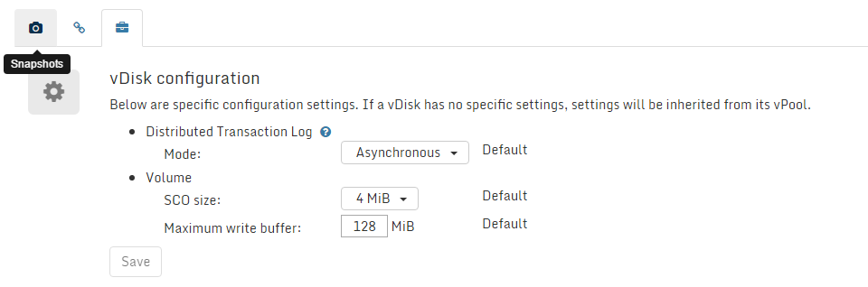

### vDisks

#### Introduction

A vDisks is a virtual disk served by Open vStorage. vDisks can be part
of a vMachine or stand-alone. By default all vDisks are snapshotted once
per hour. This snapshot schedule can not be changed for the moment.

#### vDisk Overview

The vDisk overview lists all the vDisks in the Open vStorage Cluster.

For each vDisk following info is displayed:

-   Name: Name of the vDisk. You can click on the name of a vDisk to see
    [more details](#vdisk_details) and execute actions.
-   vMachine: The vMachine to which the vDisk is attached.
-   vPool: The vPool the vDisks is stored on.
-   Storage Router: The  Storage Router to which the vDisk connects
    to access its storage.
-   Size: Size of the vDisk.
-   Stored Data: Total size of the current data and the Snapshots
    without the overhead imposed by the Backend redundancy.
-   IOPS: The current amount of IOPS delivered by the vPool to the
    vDisk.
-   Read: The current read speed of the vDisk.
-   Write: The current write speed of the vDisk.
-   DTL: Status of the Distributed Transaction Log, a copy of the write buffer of the
    vDisk, on another Storage Router to prevent dataloss. The status can be healthy
    of degraded.

### vDisk Details

The vDisk Details page displays the detailed performance statistics of a
single vDisk.

Following information about the vMachine is displayed on the detail
page:

-   vMachine: The vMachine to which the vDisk is attached.
-   vPool: The vPool the vDisks is stored on.
-   Storage Router: The Storage Router to which the vDisk connects to
    access its storage.
-   Size: Size of the vDisk.
-   Stored Data: Total size of the current data and the Snapshots
    without the overhead imposed by the Backend redundancy.
-   \# Snapshots: The amount of snapshots stored of the vDisks.
-   DTL: Status of the Distributed Transaction Log, a copy of the write cache of the
    vDisk, on another Storage Router to prevent data loss. The status can be healthy
    of degraded.
-   Backend location: GUID of the vDisk on the backend.
-   IOPS: The current amount of IOPS delivered by the vPool to the
    vDisk.
-   Read: The current read speed of the vDisk.
-   Write: The current write speed of the vDisk.

#### vDisk Actions

##### Create a vDisk
-   Click the *Add new vDisk* button on the vDisk overview page.
-   Give the new vDisks a name, enter a size, select the vPool in which the vDisk should be hosted and select a Storage Router from that vPool. Click *Finish* to create the vDisks.

##### Rollback

Rollback the vDisk and to a previous
snapshot. This action can only be executed on stopped vMachines and the
rollback can not be undone.

##### Clone the vDisk

Cloning a vDisks creates a new vDisk based upon a snapshot of the selected vDisk. Only new data written to the cloned vDisks will be stored on the backend.

##### Snapshots

At the bottom of the vDisk Details page all snapshots of the vDisk are
listed.

#### Management actions
Under Management actions you can define the settings for the VDisk:
-   Distributed Transaction Log mode: Currently the DTL can be disabled (no DTL), synchronously (sync every 4K write) or asynchronously (sync on fsync from the VM).
-   The Caching method: Cache on Read/Cache on Write or no cache (all-flash backend).
-   Deduped/non-deduped policy for vDisks. In case the setting is set to deduped it can be changed to non-deduped. Changing a vDisk from non-deduped to deduped isn't supported. It is advised to limit to the size the non-deduped vDisk can take in the read cache.
-   The SCO size: a collection of writes which gets stored on the Backend.
-   Size of the Write Buffer: the amount of data that can be in the DTL but not available in the Backend.

