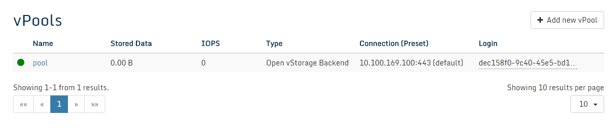

### vPools

#### Introduction

A vPool is a Virtual Storage Pool, a single namespace  used to deploy
vDisks. A vPool can span multiple Storage Routers and connects to a single
Storage Backend. The vPools overview lists all the vPools in the Open
vStorage Cluster.

#### vPool Overview

The vPool overview lists all the vPools in the Open vStorage Cluster.

For each vPool following info is displayed:
-   Status: status of the vPool.
-   Name : Name of the vPool. You can click on the name of a vPool to see [more details](#details) and execute actions.
-   Backend (Preset): ALBA Backend and used Preset of the Backend.
-   Stored Data: Total size of the current data and the Snapshots without the overhead imposed by the Backend redundancy.
-   IOPS: The current amount of IOPS delivered by the vPool to all vDisks.

### vPool Details

The vPool Details page displays the detailed performance statistics of a
single vPool. There are 2 types of statistics: Frontend and Backend
statistics. The Frontend statistics are the performance metrics as seen
by the vDisks. The Backend statistics are based on the data exchanged with the backend.

The Frontend details for a vPool are:
-   Status: status of the vPool.
-   Stored Data: Total size of the current data and the Snapshots
    without the overhead imposed by the Backend redundancy.
-   IOPS: The current amount of IOPS delivered by the vPool to all
    vDisks.
-   Read Speed: The current read speed for all vDisks on the vPool
    together.
-   Write Speed: The current write speed for all vDisks on the vPool
    together.
-   vDisks: The amount of vDisks on the vPool.

The Backend details for a vPool are
-   Write Speed: The current write speed to the Storage Backend.
-   Read Speed: The current read speed from the Storage Backend.
-   Backend (Preset): ALBA Backend and used Preset of the Backend.

The Configuration details for a vPool are

-   SCO Size: The size of the Storage Conatiner Objects (a collection of writes) which gets stored on the Backend.
-   Cluster Size: The block size used by the vDisks on the vPool.
-   Write Buffer: The amount of data that can be in the DTL but not available in the Backend.
-   DTL mode: The way new writes are stored in the Distributed Transaction Log (DTL). The DTL is making sure that you don't have data loss when a host goes down. The DTL of a volume is configured on another host as where the volume is running and contains the outstanding writes (writes which are not yet on the backend). Every write to the write buffer (local SSDs) of a volume also gets transferred to the DTL on another host. This transfer can be disabled (no DTL), synchronously (sync every 4K write) or asynchronously (sync on fsync from the VM).
-   DTL Transport: Displays whether the vPool is using RDMA or standard TCP to transfer the DTL data.

These setting will be by default applied to all vDisks. The settings (except for the cluster size) can be changed on the individual vDisk Detail pages.

#### vPool Actions

##### Create the vPool

-   In case the GUI isn't open yet, open the [Open vStorage
    GUI](Administration/usingthegui.md) on the public IP of the Storage Router and
    enter with the default login and password: admin/admin.
-   Select from the menu **vPools** and click the **Add new vPool** button.

-   On the first tab
	-   Enter a name for the vPool.
    -   Select one of local [Backends](backends.md) or an external Backend. 
        Select a Preset from  the dropdown. This Preset defines how data is stored on the backend (e.f. 3-way replication). You can add more Presets in the detail page of a [Backend](backends.md#presets). **Once the vPool is created, you can not select a different Preset. The policy of the Preset can be updated.**
	-   Select the Storage Router as Initial Storage Router. Click **Next** to continue.
-   On the second tab
    -   Specify the fragment cache method
        - Select No Caching in case you have an all flash backend.
        - Select Read, Write or Read/Write depending on your application.
    -   Select the location of the fragment cache
        - Select **Place Fragment Cache on disk** in case you want cache data on SSDs of the Storage Router with the read role. Typically you should select this option in case you are not using an ALBA backend with an SSD performance layer.
        - Select **Use another ALBA Backend as Fragment Cache** to use an (all SSD) ALBA backend as cache layer to be used in front of the SATA backend.
-   On the third tab
    -   Define the Distributed Transaction Log mode: Currently the DTL can be disabled (no DTL), synchronously (sync every 4K write) or asynchronously (sync on fsync from the VM).
    -   Transport mode: TCP or RDMA (if available).
    -   Select the SCO size (a collection of writes which gets stored on the Backend).
    -   Select the Cluster Size, the block size used by the vDisks on the vPool.
    -   Select the Write Buffer (the amount of data that can be in the DTL but not available in the Backend).

-   On the fourth tab
    -   Validate the values and click **Finish** to complete.

Additional vPools can be added to the Storage Router by executing the
same steps again.

#### vDisks

Under vDisks all vDisks served by the vPool are listed. To see more
details of a vDisk, click its name.

#### vPool Administration

##### Storage Routers serving this vPool

All the Storage Routers which are currently serving this vPool are
indicated with a marked checkbox.  To add a Storage Router Click the **+** button next to the Storage Router name.
To remove the vPool from a Storage Router click the trash can next to the Storage Router name. Removing a vPool from being served by
a Storage Router is only possible in case there aren't any vDisks being served by
the vPool on that Storage Router.