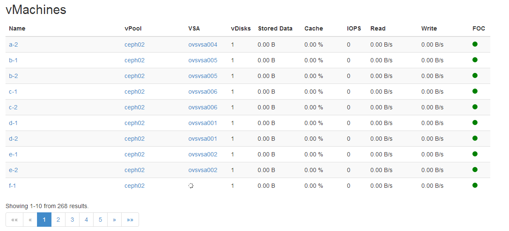

### vMachines

#### Introduction

A vMachine is a Virtual Machine with vDisks served by the Open vStorage
Cluster. A vMachine can be created through the GUI or command line
interface of the Hypervisor or in special cases, through the Open
vStorage GUI (e.g. when creating clones). Open vStorage only keeps track
of the vDisks of the vMachine. RAM, cores and network settings are not
stored within Open vStorage.

#### vMachine Overview

The vMachine overview lists all the vMachines in the Open vStorage
Cluster.

For each vMachine following info is displayed:

-   Name: Name of the vMachine. You can click on the name of a vMachine
    to see [more details](#vmachine_details) and execute actions.
-   vPool: The vPool on which the vDisks of the vMachine are stored.
-   Storage Router: The Storage Router to which the vMachine connects to
    access its storage.
-   vDisks: The amount of vDisks of the vMachine.
-   Stored Data: Total size of the current data and the Snapshots
    without the overhead imposed by the Backend redundancy.
-   Cache : The current amount of Cache Hits on the vPool by the
    vMachine.
-   IOPS: The current amount of IOPS delivered by the vPool to the
    vMachine.
-   Read: The current read speed of all vDisks of the vMachine together.
-   Write: The current write speed of all vDisks of the vMachine
    together.
-   DTM: Status of the Distributed Transaction Log, a copy of the write cache of each
    vDisk of the vMachine, on another Storage Router to prevent data loss. The
    status can be healthy of degraded.

### vMachine Details

The vMachine Details page displays the detailed performance statistics
of a single vMachine.

Following information about the vMachine is displayed on the detail
page:

-   Host: Friendly name of the ESXi given during installation of the
    Storage Router.
-   Host IP: The Public IP address of the Host.
-   Type: Type of Hypervisor.
-   Storage Router: The Storage Router to which the vMachine connects to
    access its storage.
-   vPool: The vPool on which the vDisks of the vMachine are stored.
-   vDisks: The amount of vDisks of the vMachine.
-   DTL: Status of the Distributed Transaction Log, a copy of the write cache of each
    vDisk of the vMachine.
-   Cache : The current amount of Cache Hits for the vMachine.
-   IOPS: The current amount of IOPS consumed by the vMachine.
-   Read Speed: The current read speed for all vDisks of the vMachine.
-   Write Speed: The current write speed for all vDisks of the vMachine.

#### vMachine Actions

##### Snapshot

Create a manual Snapshot of all vDisks of the vMachine. You can give the Snapshot a name and label it as
consistent.

##### Set as vTemplate

Set as vTemplate converts the selected vMachine into a vTemplate. This action can not be reversed. A
last Snapshot of the vMachine will be created to capture the latest data
chages. The vMachine will be removed as active Virtual Machine from the
Host and can no longer be changed. You can of course [create a new
vMachine](vtemplates.md#createfromvtemplate) based upon the created vTemplate. This
action can only be executed on stopped vMachines.

Note that the vTemplate will not be visible in the GUI of the Hypervisor
as Template.

##### Rollback

Rollback the vMachine and to a previous snapshot. This action can only be executed on stopped vMachines
and the rollback can not be undone.

#### vDisks

Under vDisks all vDisks of the vMachine are listed. To see more details
of a vDisk, click its name.

#### Snapshots

The second tab of the vMachine detail page, all snapshots of the
vMachine are listed.