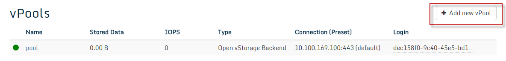

### Create the vPool

-   In case the GUI isn't open yet, open the [Open vStorage
    GUI](Administration/usingthegui.md) on the public IP of the Storage Router and
    enter with the default login and password: admin/admin.
-   Select from the menu **vPools** and click the **Add new vPool** button.

-   Enter a name for the vPool and select the type of Storage Backend:
    -   In case **S3 compatible** is selected you will need to provide an
        access key, a secret key and connection (url or IP) and port to
        access the S3 compatible Storage Backend.
    -   In case **Ceph S3** is selected you will need to provide an access
        key, a secret key and connection (url or IP) and port to access
        the Ceph Storage Backend.
    -   In case **SWIFT S3** is selected you will need to provide an
        access key, a secret key and connection (url or IP) and port to
        access the Swift Storage Backend.
    -   In case **Distributed FS** (distributed filesystem) is selected,
        no additional info is required. Select this option in case you
        want to use an external NFS share or a distributed file system.
        Please note that the file system or share must be mounted on
        each node.
    -   In case Open vStorage Backend is selected, you can select one of
        previously created local [Backends](Administration/backends.md). Leave the **Use
        local Open vStorage Backend** checked and press **Next** to load
        the available Backends. Use this option in case you want to run
        Open vStorage hyperconverged (using the SATA disk inside the
        Storage Router as Tier 2 storage). Select a Preset from  the dropdown. This Preset defines how data is stored on the backend (e.f. 3-way replication). You can add more Presets in the detail page of a [Backend](/doc/backends). **Once the vPool is created the Preset can't be changed.**
-   Select the Storage Router as Initial Storage Router. Click **Next** to continue.

-   On the second tab
    -   Specify the Read and write Cache size to be assigned for the vPool on the Storage Router.
    -   Select the Storage IP. Use 127.0.0.1 in case of KVM or the IP in Storage Network for ESXi.

-   On the third tab
    -   Define the Distributed Transaction Log mode: Currently you can set the DTL to on or off.
    -   Select the default Caching method for vDisks.
    -   Select the default deduped/non-deduped policy for vDisks. In case the value is set to deduped, the value can be overwritten on the vDisk detail page.
    -   Select the SCO size (a collection of writes which gets stored on the Backend).
    -   Select the Write Buffer (the amount of data that can be in the DTL but not available in the Backend).

-   On the fourth tab
    -   In case you have a [Hypervisor Management Center](Administration/administration.md#hmc) (vCenter, OpenStack) configured, you can automatically configure the vPool on the hypervisor.
    -   In case you don't have a Hypervisor Management Center configured, you will not be able to check the checkbox. Some manual actions might have to be taken to correctly configure the host to use the vPool.

-   On the fifth tab
    -   Validate the values and click **Finish** to complete.

Additional vPools can be added to the Storage Router by executing the
same steps again.