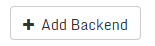

### Create an Open vStorage Backend

**This step is only required in case you installed the Open Storage
Backend packages (openvstorage-hc). In case you only installed the Open vStorage core
packages you can skip to the [add vPool section](#addvpool).**

-   Open the [Open vStorage GUI](Administration/usingthegui/) on the public IP of
    the Storage Router and enter with the default login and password:
    admin/admin.
-   Select from the menu **Backends** and click the **Add Backend** button.

-   Give the Backend a name and click **Finish**. Only the letters a-z,
    numbers and dashes (not as first or last character) are allowed. A
    minimum of 3 and a maximum of 50 characters has to be maintained.
-   Once the Backend is created in the model, the page will refresh and
    the Backend Details page will be featured.
-   By default all nodes with a Storage Router are shown. Additional
    nodes can be added by clicking the **Discover** button.
-   Select the Initialize all disks icon (  ) of each ASD
    Node in the list. The initialization might take a while.
-   Once all disks are **Available** (dark blue), select the Claim all
    disks icon (  ) of each ASD Node.
-   You can now [create a vPool](#addvpool) which uses this Backend by
    selecting Open vStorage Backend as Backend Type.
-   Optionally you can create a new [preset](Administration/usingthegui/backends.md#presets). Select the <i class="fa fa-flip-vertical fa-code-fork"></i>-icon on the Backend detail page to see the default policies or create a new one.
