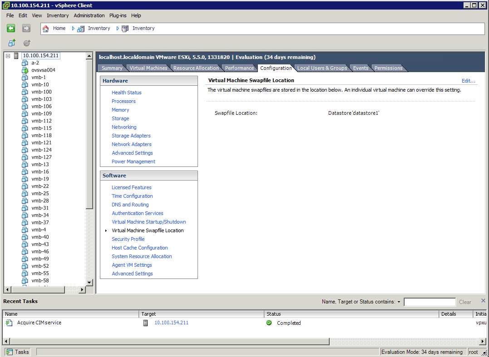
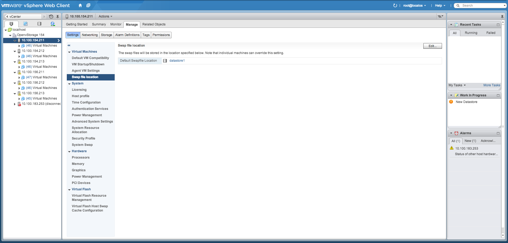

## Essentials
### Introduction

This section should be read by everyone that wants to install or use
Open vStorage. In case the below Essentials are not followed, Open
vStorage may not function, or may not function as desired and data loss
might occur. It contains recommended/supported hardware configurations
and supported Storage Backends.

### 1 or 3+ nodes
Open vStorage can be setup on a single node or 3+ nodes. It is not advised to have a 2 node setup as
the cluster will become unavailable when 1 of the 2 nodes goes down.

### Hardware requirements
-   Minimal requirements
    -   1 SATA disk for the OS and optionally at least 3 additional SATA disks for the Open vStorage Backend (hyperconverged).
    -   1 SSD or PCIe flash card  for the cache (min. 100GB) for the write and DB role.
    -   Gigabit ethernet
    -   In case you want to use the Open vStorage Backend
        - The switch must support IGMP (igmp snooping and igmp snooping querying must be enabled).
        - Replacing SATA disks is only supported with LSI controllers which support StorCLI.
-   Advised configuration
    -   An enterprise SSD or PCI Flash card (min. 100GB) for the write and DB role.
    -   10 GB ethernet (with RoCE support)
-   A typical setup for a hyperconverged cluster is one or more [Super Micro Fat Twins](https://www.supermicro.com/products/system/4U/F628/SYS-F628R3-RC1BPT_.cfm). Each node contains:
    -   2 * Intel E5-2630/E5-2660
    -   128-192 GB RAM
    -   1 * Intel DC P3600 400GB PCIe Flash
    -   2 * Intel DC S3500 800GB SSD
    -   6 * 4TB SATA disks
    -   Dual 10GbE (RoCE)

### Installation remarks

-   All nodes should have the same OS and be
    configured with the same timezone.
-   Installing a third node when the first or second node is offline
    doesn't work.
-   Starting the Open vStorage configuration step of a node when the
    previous node is not completely configured is not supported.
-   All nodes must have the same version of Open vStorage installed.
-   When installing the Open vStorage software, an `ovs` user is created. Remove previously created `ovs` users before starting the installation.

### Supported Hypervisors
-   VMware ESXi 5.1 P01 (experimental, single vPool only)
-   VMware ESXi 5.5 (experimental, single vPool only)
-   VMWare ESXi 6 (experimental, single vPool only)
-   KVM (raw disks only)

### Ports used by Open vstorage
Following ports are used by the different Open vStorage components

#### Framework
##### Master Nodes
-  22 (SSH)
-  443 (API , GUI)
-  5672 (Rabbitmq)
-  6379 (Redis)
-  2379 (ETCD, optional)

##### Extra nodes
-  22 (SSH)
-  443 (API)
-  5672 (Rabbitmq)
-  6379 (Redis)
-  2379 (ETCD, optional)

#### Volume Driver
-  26200-26299 (Storagedriver, ALBA proxy)
-  26300-26399 (mds)
-  26400-26499 (Arakoon)

#### ALBA:
-  8500 
-  [8600+...] 
-  multicast group 239.1.2.3 port 8123


### ISO files
Currently it is strongly advised not to store ISO files on the vPool.
Performance might be severely impacted when storing large non-volume
files on the vPool.

#### VMware
#### Unsupported VMware functionality
Currently not all functionality as offered by the VMware hypervisor is supported. Following features are not supported:

-   Snapshots taken through the VMware interface
-   Distributed Power Management
-   Storage Replication Adapter
-   VMware storage policy

#### Swap files
ESXi creates by the default the vMachine memory swap file within the
vMachine directory \<vPool Datastore\>/\<VM Name\>. This means this big
swapfile ends up on the distributed filesystem mountpoint which is being
synchronised between the different GSR's. For the swap file this is not
required. All functionality is still available when relocating this type
of files to a Datastore which is local to your hypervisor node (f.e.
Datastore1).

How to change this default behavior can be seen in the screenshots below
for the vSphere Client and the vSphere Web Client.





### OS for the VM Storage Router
The Storage Router has been tested with Ubuntu 16.04 64 bit as
Operating System. Other Linux OS (linux-image >= 3.15) might also work. The Open vStorage
software is not installable on a 32 bit OS.

### Limit to the amount of vDisks/Storage Router
#### RAM Limitation

The amount of RAM assigned to a Storage Router limits the amount of
vDisks which can be served by the Storage Router. The framework and
vStorage Driver need between 4 and 6GB to function. Each additional
vDisks requires 100MB. This means that on a Storage Router with 16GB RAM
assigned, 100 vDisks can be served.


#### Space Limitation
Assuming sufficient resources (CPU/RAM) are available in the Storage
Router, the maximum number of vDisks per Storage Router is limited to
512.

The amount of volumes per Storage Router is also limited by the amount
of cache space in the Storage Router. The maximum can be calculated as
follow:

```
volumes < SCOcacheNetCapacity / 80 MiB
```

In this calculation SCOcacheNetCapacity = (mountpoint1\_capacity - 1GB)
+ (mountpoint2\_capacity - 1GB) + ... The mountpoint capacity (size of
the scocache\_mount\_points) can be found for each vPool in the [distributed configuration management system](../administration/usingthecli/configmgmt.md).

```
"scocache": {
    "trigger_gap": "1GB",
    "scocache_mount_points": [
      {
        "path": "/mnt/cache/sco_vpool1",
        "size": "10895360KiB"
      }
    ],
    "backoff_gap": "2GB"
  },
```


### Supported Storage Backends

-   Open vStorage Backend (ALBA)
-   (Distributed) Filesystems
-   Amazon S3 compatible object stores:
    -   The Storage Backend must support both object and bucket methods.
    -   Ceph, Swift, ...

### Hostnames
Open vStorage currently works IP based. When browsing to the Open vStorage GUI, please use the ip address instead of the hostname.

### RDMA
Open vStorage only supports RDMA in clusters where each node of the cluster has RDMA capable hardware.

### Getting Help

Open vStorage has a large community which is more than happy to provide
advice and help when you are having issues. The community is free to
join, but keep in mid that communities only work if you give back from
time to time. You can find the Open vStorage community
[here](https://groups.google.com/forum/#!forum/open-vstorage).


