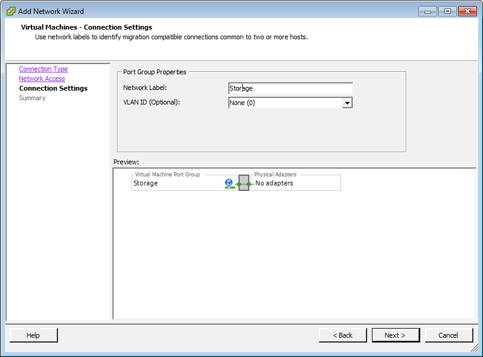

## Install Open vStorage on ESXi

### Introduction

This section provides a detailed step-by-step guide on how to setup Open
vStorage on 3 or more Nodes. The guide requires you to have at least 3
freshly installed ESXi servers. At the end of the guide you will be
ready to deploy a Virtual Machine on the Open vStorage Cluster. When you
encounter issues or are stuck somewhere, do not hesitate to ask for help
in the public [Open vStorage Forum](https://groups.google.com/forum/#!forum/open-vstorage).

### What do you need to install Open vStorage on multiple nodes?
-   At least 3 VMware ESXi compliant servers with at least 3 disks and
    install media for ESXi. For performance reasons at least 1 SSD or
    PCI-flash card is required.
-   [Ubuntu server 14.04.2 64 bit
    ISO](http://releases.ubuntu.com/14.04.2/ubuntu-14.04.2-server-amd64.iso).
-   The
    [deployOvs.py](https://github.com/openvstorage/openvstorage/blob/master/scripts/deployment/deployOvs.py)
    script (browse to openvstorage / scripts / deployment /) from
    [GitHub](https://github.com/openvstorage/openvstorage/).
-   In case you want to install Open vStorage Hyper-converged, at least 3 additional SATA disks are required for the Open vStorage Backend.
-   Per GB read cache on SSD/PCI-e flash, you will need to reserve 10 MB RAM in the Open vStorage Storage Router.

### Prerequisites before starting this guide:
-   Enable all C-states in the BIOS of the Hosts for optimal
    performance.
-   The ESXi OS is installed (preferably on 2 disks in RAID
    1). Each Host has an IP address in the Public network and SSH is
    enabled.
-   The ESXi Hosts need to have an SSD/Flash disk (min. 100GB).
-   Ensure that the ESXi Hosts have at least 50GB of free space on the
    Datastore.
-   Ensure no remainder of previous Open vStorage installs are left
    behind (e.g. previous vMachines, Storage Routers or vPools) on the
    Hosts.
-   The [Ubuntu server 14.04.2 64 bit
    ISO](http://releases.ubuntu.com/14.04.2/ubuntu-14.04.2-server-amd64.iso)
    and the
    [deployOvs.py](https://github.com/openvstorage/openvstorage/blob/master/scripts/deployment/deployOvs.py)
    script are uploaded to the ESXi Datastore of each Host.
-   VMware vSphere is required for High Availability (HA).

### Prepare the Network on the ESXi Hosts for Open vStorage

Open vStorage requires 2 networks to be available:

-   Public: the public side, serving the GUI and API.
-   Storage: connecting the Grid Storage Router and the ESXi Host.

Below you can find an example network configuration. Adjust it to your
situation.

-   Open the vSphere Client, connect to the ESXi Host and provide
    credentials when prompted. Select the *Configuration* tab.


-   Select *Networking* from the hardware section.


-   Select *Properties...* of vSwitch0.


-   Select VM Network and select *Edit...*


-   Set the Network Label to Public. Click *OK* to confirm.


-   Click *Close* to save the changes to vSwitch0.


-   Create a second Virtual Switch. Select *Add Networking...*.


-   Select *Virtual Machine* as Connection Type and click *Next \>*.


-   Unselect all NICs and click *Next \>*.


-   Change the Network Label to *Storage* and click *Next \>*.



-   Click *Finish* to create the Private Switch.


-   Select *Properties...* of vSwitch1 and select *Add*.


-   Select *VMkernel* as Connection Type and click *Next \>*.
-   Leave everything to default and click *Next \>*.


-   Select an IP address for the ESXi Host and define the Subnet Mask.
    Click *Next \>*.


-   Click *Finish*.


-   After the above steps, the networking should look like below.


Repeat the above steps for all ESXi Nodes in the Open vStorage Cluster.
Additional networks are advised in case you want to enable the HA
features of VMware. Please refer to the VMware best practices

### Create the Open vStorage Storage Router


On each ESXi Host create an Open vStorage Storage Router. You can use
the [DeployOvs.py](#usedeployscript) script (download it
[here](https://github.com/openvstorage/openvstorage/blob/master/scripts/deployment/deployOvs.py)) to
create the Virtual Storage Router or you can create the Open vStorage VM
[manually](#rooter-manually).

### <a name="usedeployscript"></a>Use the Open vStorage deploy script

The deploy script will create a Virtual Machine with 3 disks and
configure it as Open vStorage Storage Router. The first disk (OS) will
be stored as VMDK on the default Datastore, the second disk (SSD or PCI
Flash Card) is used for the database and the caches and the third disk
(SATA disk) can be used as local filesystem storage. In case no SATA
disks are found or if you use -s as parameter, the script will skip the
creation of the 3rd disk.

-   Login with Putty into the ESXi SSH Shell and type

```
cd /vmfs/volumes/datastore1/
chmod +x deployOvs.py
./deployOvs.py --image /vmfs/volumes/datastore1/ubuntu-14.04.2-server-amd64.iso
```

-   Select the Public network and the Storage network.
-   Select the amount of disk space to reserve for the Open vStorage
    Storage Router. Minimum required space on the Datastore is 50 GB.
-   If more than 1 SSD disk or PCI Flash Card is found, select one to
    (raw device) map to the Storage Router.
-   If more than 1 SATA disk is found, select one to (raw device) map to
    the Storage Router.
-   You can now go to the [Install Ubuntu](#installubuntu) section.

Repeat the above steps for all ESXi Nodes in the Open vStorage Cluster.

### <a name="rooter-manually"></a>Manually create the Open vStorage Storage Router

-   Open the vSphere Client and provide credentials when prompted.
-   Create a VM with a **Custom** configuration.
    -   Enter a name for the Storage Router and click **Next**.
    -   Select Datastore1 and click **Next**.
    -   Select virtual Machine Version: 8 and click **Next**.
    -   Select Linux and the appropriate distro (Ubuntu-64 bit) from the
        dropdown list and click **Next**.
    -   Select 1 virtual socket, 4 cores per virtual socket and click
        *Next*.
    -   Select 16GB RAM and click **Next**.
    -   Select 2 NICs, VMXNET3 as adapter and add one to each Network
        (Public and Storage). Click **Next**.
    -   Select as SCSI controller LSI Logic SAS and click **Next**.
    -   Select **Create a new virtual disk**, disk size 400GB and leave
        the rest to default. Click **Next**.
    -   Leave the rest to default and click **Next**.
    -   Tick the **Edit the virtual machine before completion**-box and
        select **Finish**.
-   Map the SATA disk and SSD to the Storage Router
    -   Login with Putty into the ESXi SSH Shell
    -   Execute **esxcli storage vmfs extent list**. It returns the Device
        Name used for the Datastore

```
Volume Name  VMFS UUID                            Extent Number  Device Name                                                               Partition

-----------  -----------------------------------  -------------  ------------------------------------------------------------------------  ---------

datastore1   52b06671-2a98eaec-2fe8-5404a68a0311              0  t10.ATA_____INTEL_SSDSA2CW120G3_____________________BTPR141501EM120LGN__          3
```

* List the disks in the ESXi host
```
cd /vmfs/devices/disks/
/dev/disks # ls -al
```

* Map the SATA disk(s) and SSD (which are not part of the Datastore) to the ESXi Host so you can use them in the Storage Router.

```
vmkfstools -z /vmfs/devices/disks/vml.<id of the SATA disk> /vmfs/volumes/datastore1/<name of the Storage Router>/hdd1.vmdk
vmkfstools -z /vmfs/devices/disks/vml.<id of the SSD disk> /vmfs/volumes/datastore1/<name of the Storage Router>/ssd1.vmdk


For example:
vmkfstools -z /vmfs/devices/disks/vml.0100000000202020202057442d5743415a4144303837393733574443205744 /vmfs/volumes/datastore1/ovs/hdd1.vmdk
vmkfstools -z /vmfs/devices/disks/vml.0100000000425450523134313530304c313132304c474e2020494e54454c20 /vmfs/volumes/datastore1/ovs/ssd1.vmdk
```

-   For performance reasons, configure the power management parameters
    of the ESXi Host.

```
esxcli system settings advanced set -o /Power/UsePStates --int-value=0
esxcli system settings advanced set -o /Power/UseCStates --int-value=1
```

-   In the vSphere Client
    -   Select the Open vStorage Storage Router and select **Edit
        Settings**.
    -   Add a new Hard disk by selecting **Add ...**, **Hard Disk**, **Use an
        existing virtual disk** and select the SSD disk or PCI Flash Card
        (ssd1.vmdk) from the Datastore1/<name of the Storage Router>.
    -   Add a new Hard disk by selecting **Add ...**, **Hard Disk**, **Use an
        existing virtual disk** and select the SATA disk (hdd1.vmdk) from
        the Datastore1/<name of the Storage Router>. Do the same for
        the other HDD disks.
    -   Select the CD/DVD drive and select the Ubuntu ISO from the
        Datastore as Device Type. Don't forget to check the **Connect at
        power on** checkbox.
    -   Select the Options tab, select Boot Options and tick the **Force
        BIOS setup**-checkbox.
    -   Click **OK** to save the changes.
-   You can now go to the [Install Ubuntu](#installubuntu) section.

Repeat the above steps for all ESXi Nodes in the Open vStorage Cluster.


### <a name="installubuntu"></a> Install Ubuntu on each Storage Router in the Open vStorage Cluster

-   Boot the Open vStorage Storage Router.
-   The Open vStorage Virtual Machine will boot into the BIOS Setup
    Utility. In the BIOS settings, go to the Boot tab.


1px solid black!

-   Select the *CD-ROM Drive* by pressing the *down key* twice. Move the
    *CD-ROM Drive* to the first position by pressing *+* twice.


-   Press **F10** to save and exit the Boot Utility. Select *Yes* to save
    the changes.


-   Next install Ubuntu, select your language and select **Install Ubuntu
    Server**.
-   Confirm your language, select your location and configure your
    keyboard.
-   Configure the network of the Storage Router. Select the NIC which is
    connected to the Public port group. (In case you used the deploy
    script, select eth1.) If unsure, right-click the VM, click *Edit
    Settings* and verify which NIC is connected to the Public port
    group. Enter the IP address, netmask, gateway and DNS servers. The
    GUI will be made available on the set IP address.
-   Set a hostname, create a new user (do not use ovs as username) and
    enter a password. There is no need to encrypt the home directory.
-   Select your timezone.
-   Partition the disks by selecting *Manual*.


-   Clear all disks of the Storage Router (no partitions on any of the
    disks). The result should be as the screenshot below.


-   Select **Guided partitioning**. Select **Guided - use entire disk**.


-   Select sda (marked with **VMware Virtual disk**) as disk to partition.


-   Write the changes to the disk.


-   Leave the HTTP proxy information blank and select **No automatic
    updates**.
-   Install the Open SSH server.
-   Install the GRUB boot loader. Select *No* when prompted to install
    it to the master boot record.


-   Now you can explicitly specify /dev/sda as location for the GRUB
    boot loader. Otherwise it will try to install the GRUB boot loader
    on /dev/sdb, which will result in an error.


-   Finish the Ubuntu installation by selecting **<Continue>**.


-   The Open vStorage Storage Router will boot from the installed Ubuntu
    OS.
-   In the vSphere GUI right-click the Open vStorage Storage Router,
    select **CD/DVD drive** and uncheck the **Connect at power on**
    checkbox.

Repeat the above steps for all ESXi Nodes in the Open vStorage Cluster.




-   Add the same Storage IP address to the second NIC of each Storage
    Router. The IP address needs to be in the Storage network. To set
    the IP edit /etc/network/interfaces (adjust the IP and interface
    according to your setup).

```
auto eth0
iface eth0 inet static
        address 172.22.1.100
        netmask 255.255.255.0
        network 172.22.1.0
        broadcast 172.22.1.255
```

-   Restart the network
-   You can now go to the [Install the Open vStorage
    software](#installopenvstorage) section.

Repeat the above steps for all Storage Routers in the Open vStorage
Cluster.



### Initialize the first Storage Router

-   You are now ready to initialize the first Storage Router. Execute in
    the Storage Router shell:

```
ovs setup
```

The initialization script will ask a couple of questions:

-   Enter the root credentials for the Storage Router.
-   It will search for existing Open vStorage Clusters in the network.
    In case it has found a Cluster, select the option **Don't join any of
    these clusters.**.
-   Enter a name for the Open vStorage Cluster.
-   Select the Public IP address of the Storage Router.
-   Select VMware as hypervisor. In case KVM is used as hypervisor, use
    the [KVM install documentation](kvm.md).
-   Enter the hostname of the host on which the Storage Router is
    running, the IP address and provide login and password.
-   Select the public IP address of the Storage Router.
-   Enter the root password of the Storage Router to exchange the
    necessary SSH keys.

When the install is completed a message will be displayed and you can
you can start using Open vStorage.

```
++++++++++++++++++++++++++++++++++++++++++++++++++++++++++++++++++++++++++++++++++
+++ Setup complete. +++
+++ Point your browser to http://<IP of the Storage Router> to start using Open vStorage +++
++++++++++++++++++++++++++++++++++++++++++++++++++++++++++++++++++++++++++++++++++
```









**The current Open vStorage release only supports one vPool per Storage Router.**

### Add the vPool as Datastore

-   Open the vSphere Client of the ESXi hosting the first Storage Router
    and provide credentials when prompted. Select the *Configuration*
    tab.
-   Select **Storage** from the Hardware section.
-   Select **Add Storage ...**
-   Select **Network File System** as Storage Type and click *Next*
-   Enter the shared folder Properties
    -   Server: the **Storage** IP address of the Storage Router
    -   Folder: /mnt/name of the vPool
    -   Datastore Name: name of the vPool
-   Click **Next** and **Finish**
-   Once the vPool is mounted, you can use it as Datastore for
    [vMachines created in the vSphere GUI](#create_vmachine ).

### Add more Storage Routers to the Open vStorage Cluster

Once the Open vStorage software is installed on the Storage Router of
the first Host, you can add more Storage Routers and additional ESXi
Hosts. This requires an [OS to be installed](#installubuntu) and
[configured]( #configureubuntu) and the [Open vStorage software must be
installed](#installopenvstorage) on these Storage Routers.

Execute in the shell of every Storage Router (concurrent installations of multiple nodes isn't supported):

```
ovs setup
```

The initialization script will ask a couple of questions:

-   Enter the root credentials for the Storage Router.
-   It will search for existing Open vStorage Clusters in the network.
    Select the Cluster created earlier.
-   Select the Public IP address of the Storage Router.
-   Select VMware as hypervisor. In case KVM is used as hypervisor, use
    the [KVM install documentation](kvm.md).
-   Enter the hostname of the host on which the Storage Router is
    running, the IP address and provide login and password.
-   Select the public IP address of the Storage Router.
-   Enter the root password of the Storage Router to exchange the
    necessary SSH keys.

When the install is completed a message will be displayed and you can
now [add the first vPool](#addvpool ) to this Storage Router.

```
+++++++++++++++++++++++++++++++++++++++++++++++++++++++++++++++++++++++++++++++++
+++ Setup complete. +++
+++ Point your browser to https://<IP of the Storage Router> to start using Open vStorage +++
+++++++++++++++++++++++++++++++++++++++++++++++++++++++++++++++++++++++++++++++++
```

Repeat the above commands for all Storage Routers you want to add to the
Open vStorage Cluster.

### Extending a vPool across multiple Storage Routers

-   Configure the roles for the physical disks of the Storage Routers.
-   Extend the vPool from the first Storage Router to additional Storage
    Routers by going to the vPool detail page and selecting the Storage
    Routers where you want the vPool to be available. Adding the vPool to another Storage Router
    will ask for the size of the read and write cache and  use the same Storage IP as on the first one.
-   Next open the vSphere Client on each ESXi Host and provide
    credentials when prompted. Select the **Configuration** tab.
-   Select **Storage** from the Hardware section.
-   Select **Add Storage ...**
-   Select **Network File System** as Storage Type and click **Next**
-   Enter the shared folder Properties
    -   Server: the **Storage** IP address of the Storage Router
    -   Folder: /mnt/name of the vPool
    -   Datastore Name: name of the vPool
-   Click **Next** and **Finish**
-   Once the vPool is mounted, you can use it as Datastore for
    [vMachines created in the vSphere GUI](#create_vmachine ).

### <a name="create_vmachine"></a>Create a vMachine

Once a vPool is initialized and mounted to the ESXi, you can use it as
Open vStorage datastore for vMachines.

-   Open the vSphere Client.
-   Create a virtual machine following the standard virtual machine
    creation wizard.
-   On the storage tab, select the mounted vPool as datastore.


-   Continue the virtual machine creation wizard and click **Finish**.

### Add vCenter and enable HA

-   In the Open vStorage GUI, open the Administration section and select
    Hypervisor Mgmt.
-   Click **Add new Center**, provide a friendly name, select vCenter and
    provide an administrator username, password and IP address.
-   In the Managed Hosts section, indicate all Hosts which are managed
    by the vCenter instance. This will allow these Hosts to be protected
    by HA in case this is activated in vCenter.




