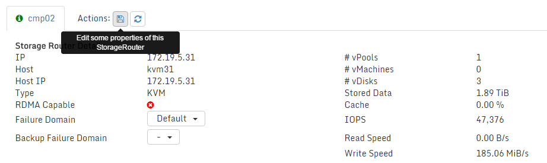

## GeoScale


### Introduction
It is possible to install Open vStorage across multiple datacenters. Open vStorage supports to stretch the vPool and the storage backend across multiple locations in case there is a low-latency link between the datacenters and enough bandwidth is available.
When you encounter issues or are stuck somewhere, do not hesitate to ask for help in the public [Open vStorage
Forum](https://groups.google.com/forum/#!forum/open-vstorage).

### Requirements
* Each datacenter should be equipped with enough SSD capacity to contain most of the active dataset of the volumes running in the datacenter.
* A layer 3 network between the different datacenters.
* An [Etcd cluster](geoscalegettingstarted.md#etcd-cluster) is required.
* Each server has the latest version of  [Ubuntu server 14.04 64 bit ISO](http://releases.ubuntu.com/14.04.3/ubuntu-14.04.3-server-amd64.iso) installed.

### Cluster Topology
This guide provides a step by step approach to install a GeoScale cluster across multiple datacenters. The cluster consists out of  4 types of nodes:
* Compute hosts: these hosts run the Virtual Machines.
* Performance nodes: these hosts run the Storage Routers. They are equipped with SSDs which act as local cache layer within the datacenter.
* Capacity nodes: these hosts, across all the datacenters, form the capacity tier. They are equipped with SATA drives.
* Management (Controller) nodes: these nodes run the master services, the GUI, the API, distributed databases, the scrubbing process and the monitoring.

More info on the topology can be found [here](../OpenvStorage/topology.md)

### OS changes
-   Update the root password to allow direct root login via ssh.
```
sudo su -
passwd
```
-   Decrease the swapiness of the OS:
```
echo 1 > /proc/sys/vm/swappiness
echo "vm.swappiness=1" >> /etc/sysctl.conf
```
-   Update the VM dirty_background_bytes:
```
echo "134217728" > /proc/sys/vm/dirty_background_bytes
echo "vm.dirty_background_bytes = 134217728" >> /etc/sysctl.conf
```

### Installing the packages

#### Controller nodes
Execute the next steps in the shell of all Controller nodes:

-   Add the repo to your sources. For older versions please check [here](../olderreleases.md).
    - Latest  Fargo version
```
echo "deb http://apt.openvstorage.org fargo main" > /etc/apt/sources.list.d/ovsaptrepo.list
apt-get update
```
    - Latest experimental version
```
echo "deb http://apt.openvstorage.org unstable main" > /etc/apt/sources.list.d/ovsaptrepo.list
apt-get update
```

-  Install the Open vStorage software:
```
apt-get install volumedriver-no-dedup-server
apt-get install openvstorage-backend
```

**NOTE:** The above steps will install the Volume Driver without deduplication (better performance, smaller metadata footprint). To install the Volume Driver with deduplication functionality use `apt-get install volumedriver-server`.

-   Initialize the Open vStorage software on each controller by executing in the shell:
```
ovs setup
```

**NOTE:** Do not run the `ovs setup` on different nodes at the same time. Wait until the setup has finished before starting the setup on another node.

- The initialization script will ask a couple of questions:
    -   Enter the root credentials for the host.
    -   It will search for existing Open vStorage Clusters in the network.
    In case it has found a Cluster, select the option *Don't join any of
    these clusters.*.
    -   Enter a name for the Open vStorage Cluster.
    -   Select the Public IP address of the KVM Node.
    -   Select whether to use an external ETCD cluster for the configuration files.
    -   Indicate if the cluster is RDMA capable. All nodes in the cluster must have RDMA capable hardware in order to have a working setup..

- When the install is completed a message will be displayed.

```
++++++++++++++++++++++++++++++++++++++++++++++++++++++++++++++++++++++++++++++++++
+++ Setup complete. +++
+++ Point your browser to http://<IP of the Storage Router> to start using Open vStorage +++
++++++++++++++++++++++++++++++++++++++++++++++++++++++++++++++++++++++++++++++++++
```

#### Performance nodes
Execute the next steps in the shell of all Compute nodes:

-   Add the repo to your sources. For older versions please check [here](../olderreleases.md).
    - Latest  Fargo version
```
echo "deb http://apt.openvstorage.org fargo main" > /etc/apt/sources.list.d/ovsaptrepo.list
apt-get update
```
    - Latest experimental version
```
echo "deb http://apt.openvstorage.org unstable main" > /etc/apt/sources.list.d/ovsaptrepo.list
apt-get update
```

-  Install the Open vStorage software:
```
apt-get install volumedriver-no-dedup-server
apt-get install openvstorage-hc
```

**NOTE:** The above steps will install the Volume Driver without deduplication (better performance, smaller metadata footprint). To install the Volume Driver with deduplication functionality use `apt-get install volumedriver-server`.

-   Initialize the Open vStorage software on each controller by executing in the shell:
```
ovs setup
```

**NOTE:** Do not run the `ovs setup` on different nodes at the same time. Wait until the setup has finished before starting the setup on another node.

- The initialization script will ask a couple of questions:
    -   Enter the root credentials for the host.
    -   It will search for existing Open vStorage Clusters in the network.
    In case it has found a Cluster, select the option *Don't join any of
    these clusters.*.
    -   Enter a name for the Open vStorage Cluster.
    -   Select the Public IP address of the KVM Node.
    -   Select whether to use an external ETCD cluster for the configuration files.
    -   Indicate if the cluster is RDMA capable. All nodes in the cluster must have RDMA capable hardware in order to have a working setup..

- When the install is completed a message will be displayed.

```
++++++++++++++++++++++++++++++++++++++++++++++++++++++++++++++++++++++++++++++++++
+++ Setup complete. +++
+++ Point your browser to http://<IP of the Storage Router> to start using Open vStorage +++
++++++++++++++++++++++++++++++++++++++++++++++++++++++++++++++++++++++++++++++++++
```

- Next configure the ASD manager on each node:
    -   Select the public IP address to use for the ASDs.
    -   Select the start port to be used by the ASDs.

- When the ASD manager setup is completed a message will be displayed:

```
+++++++++++++++++++++++++++++++++++++
+++  ASD Manager setup completed  +++
+++++++++++++++++++++++++++++++++++++
```

#### Capacity nodes:

-   Add the repo to your sources. For older versions please check [here](../olderreleases.md).
    - Latest  Fargo version
```
echo "deb http://apt.openvstorage.org fargo main" > /etc/apt/sources.list.d/ovsaptrepo.list
apt-get update
```
    - Latest experimental version
```
echo "deb http://apt.openvstorage.org unstable main" > /etc/apt/sources.list.d/ovsaptrepo.list
apt-get update
```

- Execute following to setup the ASD Manager which allows to manage the disks of the capacity node.
```
apt-get install openvstorage-sdm
```

- Retrieve the automatically generated password from the config:
```
cat /opt/alba-asdmanager/config/config.json
...
"password": "u9Q4pQ76e0VJVgxm6hasdfasdfdd",
...
```

- Repeat the above steps for each capacity node.

#### Compute Nodes
For this installation procedure, KVM is assumed to be the hypervisor of choice.

-   Add the repo to your sources. For older versions please check [here](../olderreleases.md).
    - Latest  Fargo version
```
echo "deb http://apt.openvstorage.org fargo main" > /etc/apt/sources.list.d/ovsaptrepo.list
apt-get update
```
    - Latest experimental version
```
echo "deb http://apt.openvstorage.org unstable main" > /etc/apt/sources.list.d/ovsaptrepo.list
apt-get update
```

- Install KVM and the Open vStorage QEMU package:
```
apt-get install kvm libvirt0 python-libvirt virtinst
apt-get install qemu
```

- The libvirt-qemu user need to be member of the ovs group on all nodes:
```
usermod -a -G ovs libvirt-qemu
```


### Configuring the cluster
-   Open the [Open vStorage GUI](Administration/usingthegui/) on the public IP `https://<Ip of the Controller node>` of
    one of the Controller nodes and enter with the default login and password:
    admin/admin.

#### Configure the Domains
- Under Administration > Domains, create a Domain per datacenter where compute nodes are running.
- For each Storage Router (Controller and performance nodes), on the Storage Router detail page, assign the Storage Router to the correct domain by clicking the `Edit/Save` action.
- For the Recovery Domain there are 2 options:
    - Leave it empty: in this case the DTL and a slave Metadataserver will be created in the same Domain.
    - Assign a Recovery Domain: in this case there will be a local slave Metadataserver and a slave in the Recovery Domain. The DTL will also be located in the Recovery Domain.



A Domain can only be used as a Recovery Domain entry in case ut has been used on a Storage Router as primary  Domain. The benefit of a Recovery Domain is that there is no data loss in case the primary datacenter goes offline.

#### Adding Roles to the Storage Routers
For each Storage Router select roles (read, write, DB, scrub) for the physical disks:
-   Select from the menu **Storage Routers** and select the Storage Router from the list.
-   Select the Physical Disk Management tab. On this tab you can assign roles to the different detected physical disks. To assign a role to a disk click the gear icon and select the role from the dropdown.
-   Assign a DB role to one of the SSDs. This will reserve 10% of the SSD for the database. Each Storage Router should have one disk with a DB role. Note that this role can't be removed once set.
-   Assign write role to the SSDs or PCIe flash cards you want to use as write buffer for the vPools. A Storage Router must have at least one disk with the write role assigned. The write role can only be removed in case no vPool is using them.
-   Optionally assign a scrub role to one of the disks. The scrubber is the application which does the garbage collection of snapshot data which is out of the retention. This will reserve 300 GB of space. In a cluster there must be at least 1 Storage Router with one disk with the scrubbing role. Note that this role can't be removed once set.

**NOTE:** Since this cluster will be using an Accelerated ALBA on all flash as distributed cache in each datacenter, the read role isn't set as it will not be used (no local caching by the Storage Router).

#### Create the Backends
Since this is a complex setup across multiple datacenters, the Arakoon clusters for the backends will need to be created manually.

Per datacenter an all flash backend using the disks of the Performance nodes will be created and an all HDD backend will be created using the HDDs of the capcity nodes. On top a geoscale backend is created which uses the HDD backends in each datacenter to store the data.

Per datacenter execute the following:
- To create the all flash backend, open the shell of one of the performance nodes in the datacenter and [create an ABM Arakoon cluster](geoscalegettingstarted.md#creating-cluster-abm-optional) and extend it to 2 more performance nodes in the same data center.
- [Create an NSM Arakoon cluster](geoscalegettingstarted.md#creating-cluster-nsm-optional) and extend it to 2 more performance nodes in the same data center.
- Open the Backends page in the the Open vStorage GUI
- Click **+ Add Backend**
    - Give the Backend a name
    - Select **Open vStorage Backend** as Backend type
    - Select **Local**
- Once the Backend is created and the Backend Detail page is available, locate the performance nodes of the datacenter and click the "Initialize all disks"-icon and once all SSD disk are initialized click the "Claim all disks"-icon.
- Edit the Backend to add the Domain tag of the datacenter.

- To create the HDD capacity backend, open the shell of one of the performance nodes in the datacenter and [create an ABM Arakoon cluster](geoscalegettingstarted.md#creating-cluster-abm-optional) and extend it to 2 more performance nodes in the same data center.
- [Create an NSM Arakoon cluster](geoscalegettingstarted.md#creating-cluster-nsm-optional) and extend it to 2 more performance nodes in the same data center.
- Open the Backends page in the the Open vStorage GUI
- Click **+ Add Backend**
    - Give the Backend a name
    - Select **Open vStorage Backend** as Backend type
    - Select **Local**
- Once the Backend is created and the Backend Detail page is available, locate the capacity nodes located in that datacenter and click the "Initialize all disks"-icon and once all HDD disk are initialized click the "Claim all disks"-icon.
- Edit the Backend to add the Domain tag of the datacenter.
- The default policy for a Backend has compression turned on and features a (5,4,8,3) and (2,2,3,4) policy. Additional presets can be added on the Preset tab.

Next, create GeoScale Backend by taking following actions:
- To create the geoscale backend, open the shell of one of the Controller nodes  and [create an ABM Arakoon cluster](geoscalegettingstarted.md#creating-cluster-abm-optional) and extend it to 2 more performance nodes in the same data center.
- [Create an NSM Arakoon cluster](geoscalegettingstarted.md#creating-cluster-nsm-optional) and extend it to the other Controller nodes.
- Open the Backends page in the the Open vStorage GUI
- Click **+ Add Backend**
    - Give the Backend a name
    - Select **Open vStorage** Backend as Backend type
    - Select **Global**
- Once the Backend is created and the Backend Detail page is available, link the 3 HDD backends previously created by clicking **Link Backend**.
- Edit the Backend to add the 3 datacenter tags.
- Click **Presets** tab and select **+ Add preset**. Enter a name, select whether data needs to be encrypted or/and compressed. Add at least the preset (2,1,2,1) which spread data across 3 datacenters (2 data, 1 parity) and acknowledges the write as soon as 2 datacenters are written.

**NOTE:** More info on Backends can be found [here](../Administration/usingthegui/backends.md).


#### Create the first vPool
Once the Backends are correctly setup, it is time to create the first vPool.
-   Select from the menu **vPools** and click the **Add new vPool** button.


- On the first tab
    -   Enter a name for the vPool.
    -   Select **Open vStorage Backend** as Backend.
    - Leave the **Use local Open vStorage Backend** checked and press **Reload** to load
        the available Backends. Select the GeoScale backend previously created and a Preset from the dropdown. This Preset defines how data is stored on the backend (e.f. 3-way replication). You can add more Presets in the detail page of a [Backend](Administration/usingthegui/backends.md#presets). **Once the vPool is created the Preset can't be changed.**
    -   Select the Storage Router as Initial Storage Router. Click **Next** to continue.

-   On the second tab
    - Select the mode you want the distributed read cache, the fragment cache, to be setup.
    - Select **Use another ALBA Backend as Fragment Cache**,  press **Reload** to load
        the available Backends. Select the all flash backend  which is located in the same datacenter  as the Initial Storage Router.

-   On the third tab
    -   Define the Distributed Transaction Log mode and Transport mode: Currently you can set the DTL to Disabled, Asynchronous and synchronous. The transport mode can be TCP or RDMA.
    -   Select the default Caching method for vDisks. Set to **No Cache** as the vPool uses a distributed cache instead of local caching on the Storage Router.
    -   Define how much space to reserve for the write buffer for this vPool.
    -   Select the SCO size (a collection of writes which gets stored on the Backend).
    -   Select the cluster size (blocksize of the vDisks). This setting can't be overruled.
    -   Select the default Volume Write Buffer size. This is the maximal amount of data per vDisk that can be in the DTL but not available in the Backend.

-   On the fourth tab
    -   Validate the values and click **Finish** to complete.

Additional vPools can be added to the Storage Router by executing the
same steps again.

**NOTE:** More info on vPools can be found [here](../Administration/usingthegui/vpools.md).


### Create the first vDisk
To create the first vDisks, log in into one of the compute hosts and execute:
```
qemu-img convert  <disk to import>.qcow2 openvstorage+<protocol>:<ip of the performance node>:<vPool port>/<vDisk name>
```

Some remarks:
* Protocol can be tcp or rdma.
* Replace the IP with the storage  IP of the Storage Router (performance node) which should host the vDisks.
* vPool port: to get the port of the vPool, open the Storage Router detail page and check the Edge port for the vPool listed under **Management actions**.
* vDisk name: name of the vDisks in the Open vStorage GUI.

### Setup the monitoring server
Optionally setup a server to monitor the Open vStorage cluster by following [these steps](https://openvstorage.gitbooks.io/ovs-monitoring/content/docs/deploy_with_ansible.html).