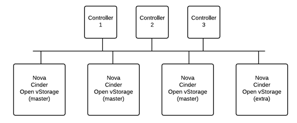

## Install Open vStorage and integrate it with OpenStack

### Introduction
This section provides a detailed step-by-step guide on how to setup Open vStorage together with OpenStack.

### Architecture Overview
Open vStorage can be used as storage platform for OpenStack through the [Open vStorage Cinder Plugin](https://github.com/openvstorage/framework-cinder-plugin). This plugin allows Open vStorage to deliver block storage for Open Stack.

In contrary to DevStack, where all OpenStack functionality runs on a single node, OpenStack has split up the functionality between different nodes. A typical setup will have 3 Controller nodes. On these Controller nodes Open vStorage should not be installed. Open vStorage should only be installed on the Nova nodes. The first 3 nodes will by default be setup as master Open vStorage nodes (GUI, API, databases, …) while additional nodes will be setup as extra nodes. For Open vStorage it is essential to also run the Cinder functionality (f.e. cinder-volume) on the Nova node.



The Compute nodes should have at least 1 SSD or PCI-flash card (min. 100GB). Per GB read cache on SSD/PCI-e flash, you will need to reserve 10 MB RAM of the Host for Open vStorage. In case you want to install Open vStorage Hyper-converged, at least 3 additional SATA disks are required for the Open vStorage Backend.


### Prerequisites before starting this guide:
-   Remove all partitions and remaining data on the physical disks. Execute for every disk other than the OS disk (replace x with the correct drive letter):
```
parted -s /dev/sdx mklabel gpt
```
-   Enable all C-states in the BIOS of the Hosts for optimal
    performance.

### Install OpenStack
- Install Ubuntu server 14.04 or CentOS7 (See OS specific parameters to set [here](kvm.md))
- Install OpenStack on the controller nodes.
- Add the Compute and Block Storage service to the Compute nodes.

*Please see the [OpenStack install instructions](http://docs.openstack.org/) for detailed steps.*





### <a name="initialize"></a>Initialize the first Storage Router

-   You are now ready to initialize the first Storage Router. Execute in
    the shell:
```
ovs setup
```

The initialization script will ask a couple of questions:

-   Enter the root credentials for the host.
-   It will search for existing Open vStorage Clusters in the network.
    In case it has found a Cluster, select the option *Don't join any of
    these clusters.*.
-   Enter a name for the Open vStorage Cluster.
-   Select the Public IP address of the KVM Node.
-   Select whether to use an external ETCD cluster for the configuration files.
-   Select KVM as hypervisor. In case VMware is used as hypervisor, use
    the [ESXi install documentation](esxi.md).
-   Select the public IP address of the Storage Router.
-   Enter the root password of the Storage Router to exchange the necessary SSH
    keys.

When the install is completed a message will be displayed.

```
++++++++++++++++++++++++++++++++++++++++++++++++++++++++++++++++++++++++++++++++++
+++ Setup complete. +++
+++ Point your browser to http://<IP of the Storage Router> to start using Open vStorage +++
++++++++++++++++++++++++++++++++++++++++++++++++++++++++++++++++++++++++++++++++++
```
In case the ALBA backend packages are installed (by means of openvstorage-hc) the ASD manager setup will start:
-   Select the public IP address to use for the ASDs.
-   Select the start port to be used by the ASDs

When the ASD manager setup is completed a message will be displayed and you can
start using Open vStorage.

```
+++++++++++++++++++++++++++++++++++++
+++  ASD Manager setup completed  +++
+++++++++++++++++++++++++++++++++++++



### Register a Hypervisor Managent Center
In the Administration section, **select Hypervisor Mgmt.**. Click Add new Center and complete the form. Next indicate at the bottom which Nova nodes you want to be managed by the OpenStack Controller Node. Do not create a vPool before you have registered the Hypervisor Management Center and added the nodes.








### Add more nodes to the Open vStorage Cluster

Once the Open vStorage software is installed on the first node, you can
add more nodes to the cluster. This requires the COmpute and Block Storage service to be added these nodes.

Execute in the shell of every Compute node (concurrent installations of multiple nodes isn't supported):

```
ovs setup
```

The initialization script will ask a couple of questions:

-   Enter the root credentials for the Compute Node.
-   It will search for existing Open vStorage Clusters in the network.
    Select the Cluster created earlier.
-   Select the Public IP address of the KVM Node.
-   Select KVM as hypervisor. In case VMware is used as hypervisor, use
    the [ESXi install documentation](esxi).
-   Select the public IP address of the Storage Router.
-   Enter the root password of the Storage Router to exchange the
    necessary SSH keys.

When the install is completed a message will be displayed and you can
now [extend the vPool](#extendvpool) to this Storage Router.

```
+++++++++++++++++++++++++++++++++++++++++++++++++++++++++++++++++++++++++++++++++
+++ Setup complete. +++
+++ Point your browser to https://<IP of the KVM> to start using Open vStorage +++
+++++++++++++++++++++++++++++++++++++++++++++++++++++++++++++++++++++++++++++++++
```

Repeat the above commands for all Storage Routers you want to add to the
Open vStorage Cluster.

### <a name="extendvpool"></a> Extending a vPool across multiple nodes

-   Configure the roles for the physical disks of the Storage Routers.
-   Extend the vPool from the first node to additional nodes by going to
    the vPool detail page and selecting the nodes where you want the
    vPool to be available. Adding the vPool to another Storage Router
    will ask for the size of the read and write cache and use the same Storage IP as on the first one.

### Changes required to the controller
- Update the maximal amount of MySQL connections in /etc/mysql/my.cnf to 1000 and restart MySQL.

### Changes required to all Nova nodes

-   On all Nova nodes execute

```
su stack
sed -i '/vnc_enabled.*/c\vnc_enabled = True' /etc/nova/nova.conf
sed -i '/vncserver_listen.*/c\vncserver_listen = 0.0.0.0' /etc/nova/nova.conf
sed -i '/instance_name_template.*/c\instance_name_template = "%(hostname)s"' /etc/nova/nova.conf
sed -i '/force_config_drive.*/c\force_config_drive = False' /etc/nova/nova.conf
sed -i '/verbose =.*/a live_migration_flag = VIR_MIGRATE_UNDEFINE_SOURCE,VIR_MIGRATE_PEER2PEER,VIR_MIGRATE_LIVE' /etc/nova/nova.conf
sed -i '/verbose =.*/a use_cow_images = False' /etc/nova/nova.conf

cat <<EOF >> /etc/nova/nova.conf

[serial_console]
base_url = http://127.0.0.1:6083/
enabled = True
listen = 127.0.0.1
port_range = 10000:20000
proxyclient_address = 127.0.0.1
EOF
```

-   Restart the Nova services
    -   On DevStack restart n-api, n-cpu, n-sch
    -   On OpenStack: service nova-api-os-compute, nova-compute,
        nova-scheduler restart
-   Libvirtd changes on all Nova nodes

```
#
# file /etc/libvirt/libvirtd.conf
#
grep -q '^listen_tls' /etc/libvirt/libvirtd.conf && sed -i 's/^listen_tls.*/listen_tls = 0/' /etc/libvirt/libvirtd.conf || echo 'listen_tls = 0' >> /etc/libvirt/libvirtd.conf
grep -q '^listen_tcp' /etc/libvirt/libvirtd.conf && sed -i 's/^listen_tcp.*/listen_tcp = 1/' /etc/libvirt/libvirtd.conf || echo 'listen_tcp = 1' >> /etc/libvirt/libvirtd.conf
grep -q '^auth_tcp' /etc/libvirt/libvirtd.conf && sed -i 's/^auth_tcp.*/auth_tcp = "none"/' /etc/libvirt/libvirtd.conf || echo 'auth_tcp = "none"' >> /etc/libvirt/libvirtd.conf
#
# generate unique uuid for libvirt
#
sed -i 's/.*host_uuid.*/host_uuid = '`uuidgen`'/' /etc/libvirt/libvirtd.conf
#
# file /etc/libvirt/qemu.conf
#
grep -q '.*dynamic_ownership' /etc/libvirt/qemu.conf && sed -i 's/.*dynamic_ownership.*/dynamic_ownership = 0/' /etc/libvirt/qemu.conf || echo 'dynamic_ownership = 0' >> /etc/libvirt/qemu.conf
#
# file /etc/default/libvirt-bin
#
sed -i '/libvirtd_opts.*/c\libvirtd_opts="-d -l"' /etc/default/libvirt-bin
#
# file /etc/init/libvirt-bin.conf
#
sed -i '/.*env libvirtd_opts=.*/c\env libvirtd_opts="-d -l"' /etc/init/libvirt-bin.conf
#
# restart libvirt and check status
#
stop libvirt-bin && start libvirt-bin || start libvirt-bin
ps -ef | grep libvirtd
```

### Configure passwordless authentication for stack user

-   Passwordless authentication is required for the stack user to allow
    the migrate workflow to complete.
-   Execute on each node as root (set a password for use in next step)
```
passwd stack
```
- On each node towards all other nodes
```
su - stack
ssh-keygen
ssh-copy-id stack@<all_other_nodes>
```

### Configuring the Open vStorage SNMP daemon
If snmpd is running on port 161 the ovs-snmp daemon will not start as by default it is also using that port. Change the ovs-snmp port by editing the config file (/etc/init/ovs-snmp.conf) and replace "--port 161" with the desired port (e.g. "--port 9161") and then restart the ovs-snmp service (service ovs-snmp restart)


### Create the first Virtual Machine
You can now use the OpenStack GUI (Horizon) to create your first Virtual Machine. When creating a volume, make sure to select the vPool from Volume Types to make sure the Virtual Machine disk are created on the vPool.
Once the disk is created on the vPool, it will become visible in the GUI under vDisks.





