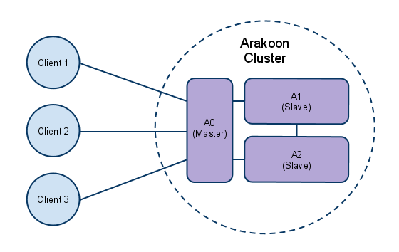

### Arakoon

[Arakoon](http://arakoon.org/) is a distributed key-value store that guarantees consistency above anything else. It was created by the Open vStorage team due to a lack of existing solutions fitting our requirements, and is available as Open Source software.

Arakoon aims to be easy to understand and use, whilst at the same time taking the following features into consideration:
* Consistency: The system as a whole needs to provide a consistent view on the distributed state. This stems from the experience that eventual consistency is too heavy a burden for a user application to manage. A simple example is the retrieval of the value for a key where you might receive none, one or multiple values depending on the weather conditions. The next question is always: Why don’t a get a result? Is it because there is no value, or merely because I currently cannot retrieve it?
* Conditional and Atomic Updates: We don’t need full blown transactions (would be nice to have though), but we do need updates that abort if the state is not what we expect it to be. So at least an atomic conditional update and an atomic multi-update are needed.
* Robustness: The system must be able to cope with failure of individual components, without concessions to consistency. However, whenever consistency can no longer be guaranteed, updates must simply fail.
* Locality Control: When we deploy a system over 2 datacenters, we want guarantees that the entire state is indeed present in both datacenters. This is something we could not get from distributed hash tables using consistent hashing.
* Healing & Recovery: Whenever a component dies and is subsequently revived or replaced, the system must be able to guide that component towards a situation where that node again fully participates. If this cannot be done fully automatically, then human intervention should be trivial.
* Explicit Failure: Whenever there is something wrong, failure should propagate quite quickly.

### Where is Arakoon used in Open vStorage?
Arakoon is as database for various components of the Open vStorage cluster.
* The [Framework](../Framework/README.md) model is stored in the DB named **ovsdb**. It stores the details or Storage Routers, vDisks, vMachine, vPools.
* The [Volume Driver](../VolumeDriver/README.md) model is stored in the DB named **voldrv**. It stores the Volume Driver cluster config, the metadata of the File System (mapping from /path/to/file -> object ID (volumedriver or filedriver object) exposed by the Volume Driver, the Object Registry - the location of objects in the cluster (which VolumeDriver in the cluster runs "owns" the file/volume), the family tree of a volume (clone-parent relation), replication , distributed locking and scrub management.
* The metadata of the [ALBA backend](../ALBA/README.md) are stored in a ABM DB and multiple NSM DBs. The NSM DBs (NameSpace Manager DBs) contain the meta of each stored fragment (ASD, manifest). A single NSM DB can contain data for different namespaces (volumes). The ABM DB (ALBA Manager) contains which NSM DB contains the metadata for which namespace/volume.

### An Arakoon deployment
An Arakoon cluster consist of a small collection of nodes (typically 1,2,3 or 5 nodes) that contain the full range of key-value pairs, and clients that manipulate the key/value space. In principle, all nodes have the entire key/value space. There is one distinguished node called the master with which all clients communicate to perform updates. A client contacts any node to find out the master, and then just conversates with the master. If a master dies, a new one is elected automatically, and clients fail over to that master. A slave node is a node that is not master. A node that is not up-to-date cannot become master.

The diagram below shows 3 clients connected to an Arakoon cluster that consists of 3 Arakoon nodes.


Update to the Arakoon database are consistent. An Arakoon client always looks up the master of a cluster and then sends a request to the master. The master node of a cluster has a queue of all client requests. The moment that a request is queued, the master node sends the request to all his slaves and writes the request in the Transaction Log (TLog). When the slaves receive a request, they store this also in their proper TLog and send an acknowledgement to the master.

A master awaits for the acknowledgements of the slaves. When he receives an acknowledgement of half the nodes plus one, the master pushes the key/value pair in its database. In a five node setup (one master and four slaves), the master must receive an acknowledgement of two slaves before he writes his data to the database, since he is also taken into account as node.

After having written his data in his database, the master starts the following request in his queue. When a slave receives this new request, the slaves first write the previous request in their proper database before handling the new request. This way a slave is always certain that the master has successfully written the data in his proper database.

If the master node dies, a new master election happens using [paxos](https://en.wikipedia.org/wiki/Paxos_(computer_science)). If a slave dies, the master is not affected. When a slave comes up, it tries to catchup. The slave first downloads the missing parts of the log. Then it iterates over the tlog while adding the missing updates to its local store. When finished the client again compares its log state with that of the other nodes to make sure it is up to date.

The directory structure of a node typically looks like this:
```
root@cmp02:/opt/OpenvStorage/db/arakoon/ovsdb# ls -als
total 0
0 drwxr-xr-x 1 ovs ovs 14 Dec  1 17:29 .
0 drwxr-xr-x 1 ovs ovs 10 Dec  1 17:29 ..
0 drwxr-xr-x 1 ovs ovs 84 Dec  2 13:22 db
0 drwxr-xr-x 1 ovs ovs 58 Dec  3 12:07 tlogs
root@cmp02:/opt/OpenvStorage/db/arakoon/ovsdb/db# ls -als
total 680
  0 drwxr-xr-x 1 ovs ovs     84 Dec  2 13:22 .
  0 drwxr-xr-x 1 ovs ovs     14 Dec  1 17:29 ..
676 -rwxr-xr-x 1 ovs ovs 690176 Dec  3 14:03 tGLpPNHEDxNOOqOZ.db
  4 -rw-r--r-- 1 ovs ovs    276 Dec  3 14:03 tGLpPNHEDxNOOqOZ.db.wal
root@cmp02:/opt/OpenvStorage/db/arakoon/ovsdb/tlogs# ls -als
total 13744
   0 drwxr-xr-x 1 ovs ovs      58 Dec  3 12:07 .
   0 drwxr-xr-x 1 ovs ovs      14 Dec  1 17:29 ..
3732 -rw-r--r-- 1 ovs ovs 3819824 Dec  2 08:32 000.tlx
3776 -rw-r--r-- 1 ovs ovs 3863492 Dec  2 21:09 001.tlx
3920 -rw-r--r-- 1 ovs ovs 4013559 Dec  3 12:07 002.tlx
2316 -rw-r--r-- 1 ovs ovs 2368293 Dec  3 14:03 003.tlog
```

nodename.db: the actual key/value store.
nodename.db.wal: security database to keep the key/value store consistent, for example in case of a failure.
XXX.tlog: The transaction log files, contains the logs for all transactions executed on the node.
XXX.tlx: A compressed transaction log file.

### Arakoon config files
The Arakoon config files for Open vStorage are stored under **/opt/OpenvStorage/config/arakoon/database_name/**. See the [Config section](../../Administration/Configs/arakoon.md) for more details.

### Arakoon Log files
The log files for the different Arakoon databases can be found under **/var/log/arakoon**.

#### Basic Arakoon commands
##### List all Arakoon databases
All Arakoon DBs are running as a service with as name ovs-arakoon-databasename.

```
ovs monitor services

...
ovs-arakoon-ovs-bknd-poc01-abm start/running, process 16308
ovs-arakoon-ovs-bknd-poc01-nsm_0 start/running, process 20064
ovs-arakoon-ovsdb start/running, process 19901
ovs-arakoon-voldrv start/running, process 20400
...
```
In this case we have 4 Arakoon clusters running: ovsdb, voldrv, ovs-bknd-poc01-nsm_0 and ovs-bknd-poc01-abm.


##### Start an Arakoon cluster
To start the ovsdb cluster:

```
start ovs-arakoon-ovsdb
```

##### Retart an Arakoon cluster
To restart the ovsdb cluster:

```
restart ovs-arakoon-ovsdb
```


##### Stop an Arakoon cluster
To start the ovsdb cluster:
```
stop ovs-arakoon-ovsdb
```

##### Check if an Arakoon cluster has a master
An Arakoon cluster always has one master node. Arakoon uses Multi-Paxos to decide which node becomes the master node. In the below code sample we will check if the ovsdb is functioning correctly and has a master node selected.
```
/usr/bin/arakoon --who-master -config /opt/OpenvStorage/config/arakoon/ovsdb/ovsdb.cfg
```
The result will be the id of the selected master node.

#####  Basic Set/Get/Delete
```
cluster$> arakoon -config /opt/OpenvStorage/config/arakoon/ovsdb/ovsdb.cfg --set some_key some_value
cluster$> arakoon -config /opt/OpenvStorage/config/arakoon/ovsdb/ovsdb.cfg --get some_key
"some_value"

cluster$> arakoon -config /opt/OpenvStorage/config/arakoon/ovsdb/ovsdb.cfg --delete some_key
cluster$> arakoon -config /opt/OpenvStorage/config/arakoon/ovsdb/ovsdb.cfg --get some_key
Fatal error: exception Arakoon_exc.Exception(5, "some_key")
```

##### Collapsing TLogs
When the number of updates is higher than the number of additions, the collection of TLogs keeps on growing. You can however reduce the space needed on disk if you collapse old TLogs into a head database.

To collapse the TLogs:
```
/usr/bin/arakoon --collapse <tlog_dir> <n>
```
Where the <tlog_dir> is defined in the Arakoon configuration file and <n> is the number of TLogs that must remain. For example when you have 40 TLog files in /tmp/Node_0 and you want to keep the five most recent TLogs, run this command:
```
arakoon --collapse /tmp/Node_0 5
```
##### Investigating TLogs
It is not possible to read TLogs as stored on the file system. If you want human-readable output, you need a dump of the TLog.
```
/usr/bin/arakoon --dump-tlog <path_to_tlog_file>
```
For example:

```
arakoon --dump-tlog /opt/OpenvStorage/db/arakoon/ovsdb/tlogs/003.tlog

308476:(Vc ([Delete         ;"ovs-watcher-026829a5-2792-4f53-b9f3-ea730ccef3ac";],false)
308477:(Vm (tGLpPNHEDxNOOqOZ,1449145497.000000))
308478:(Vc ([NOP;],false)
308479:(Vc ([Set            ;"ovs_celery_beat_lock";55;"...";],false)
308480:(Vc ([Set            ;"ovs-watcher-fd1159ae-df01-48c2-92ff-69b4a6df94d0";15;"...";],false)
308481:(Vc ([Delete         ;"ovs-watcher-fd1159ae-df01-48c2-92ff-69b4a6df94d0";],false)
308482:(Vc ([Set            ;"ovs-watcher-c400c259-05f0-4a2a-a665-8b11195ee2df";15;"...";],false)
308483:(Vc ([Delete         ;"ovs-watcher-c400c259-05f0-4a2a-a665-8b11195ee2df";],false)
308484:(Vc ([Set            ;"ovs-watcher-c518c1ab-c606-4b9e-a119-d3a0fda7efc6";15;"...";],false)
308485:(Vc ([Delete         ;"ovs-watcher-c518c1ab-c606-4b9e-a119-d3a0fda7efc6";],false)
308486:(Vc ([Set            ;"ovs_data_storagerouter_5f081738-4447-4dff-85a3-b4f537fab9ce";879;"...";],false)
308487:(Vc ([Set            ;"ovs_data_storagerouter_60525280-7159-4dd6-a3d0-331a0742490a";879;"...";],false)
308488:(Vc ([Set            ;"ovs_data_storagerouter_8cbc1463-28ef-4813-a33d-1972356dd6c0";879;"...";],false)
308489:(Vm (tGLpPNHEDxNOOqOZ,1449145502.000000))
308490:(Vc ([NOP;],false)
308491:(Vc ([Set            ;"ovs_data_storagerouter_5f081738-4447-4dff-85a3-b4f537fab9ce";879;"...";],false)
308492:(Vc ([Set            ;"ovs_data_storagerouter_5f081738-4447-4dff-85a3-b4f537fab9ce";879;"...";],false)

...
```

##### Backing up the database
You can perform a hot backup from a live slave node from the command line. If you also backup the tlogs and conifguration file of the node, you have all the required data to be able to rebuild a node. This type of backup allows you to be able to recover from multi-node failure.

The backup of the database can be done by running the following command:
```
# arakoon --backup-db <cluster_id> <ip> <port> <location>
# e.g.
arakoon --backup-db ricky 127.0.0.1 7080 /mnt/drv/2011-19-07/mybackup.db
```

#### A simple example using the OVS Python Client
How to manage Arakoon through the  python API is best explained through a simple example. The code below creates a client and grows the cluster:

Start the OVS client
```
ovs
```

Extend the cluster with a new node (new_ip)
```
from ovs.extensions.db.arakoon.ArakoonInstaller import ArakoonInstaller
ArakoonInstaller.extend_cluster(master_ip, new_ip, cluster_name, exclude_ports, base_dir)
```