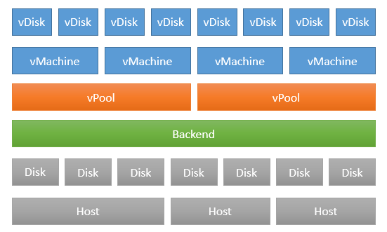

### Architecture

### Introduction
Here we discuss the architecture of of Open vStorage:

### vDisks, vMachines, vPools and Backends
et's start from the bottom, the physical layer, and work up to the virtual layer. For the sake of simplicity we assume a host has one or more SATA drives. With the hyper-converged version (openvstorage-hc) you can unlock functionality to manage these drives and assign them to a Backend. Basically a Backend is nothing more than a collection of physical disks grouped together. These disks can even be spread across multiple hosts. The implementation even gives you the freedom to assign some physical disks in a host to one Backend and the other disks to a second Backend. The only limitation is that a disk can only be assigned to a single Backend at the same time. The benefit of having this Backend concept allows to separate customers even on physical disk level by assigning each of them its own set of hard drives.

On top of a Backend you create one more vPools. You could compare this with creating a LUN on a traditional SAN. The benefit of having the split between a Backend and a vPool allows to have additional flexibility:
* You can assign a vPool per customer or per department. This means you can for example bill per used GB.
* You can set a different encryption passphrase per vPool.
* You can enable or disable compression per vPool.
* You can set the replication factor per vPool. For example a “test” vPool, where you store only a single copy of the Storage Container Objects (SCOs) but for production servers you can configure 3-way replication.

On top of the vPool, configured as a Datastore in VMware or a mountpoint in KVM, you can create vMachines. Each vMachine can have multiple vDisks, Virtual disks. For now vmdk and raw files are supported.