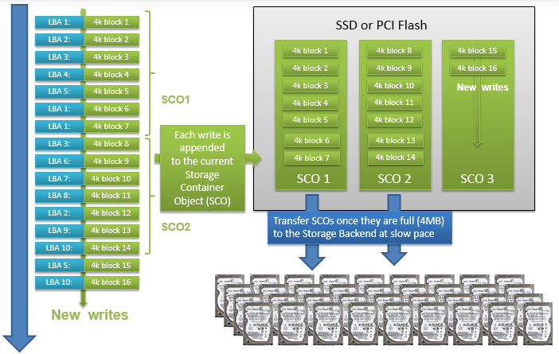

##### Write Buffer
The write buffer is located on the devices of a [Storage Router](../../Administration/Usingthegui/storagerouters.md#physicaldiskmgmt) which are configured with the Write role. Typically this role is assigned to fast PCI-e flash cards or high endurance SSDs.
When a new 4K write is executed on a vDisk, the write gets added to a log file which is located in one of the write buffer mount points (the scocache_mount_points in the [Volume Driver config file](config.md)). This log file is called a Storage Container Object (SCO). Once enough writes are received, the SCO is closed and marked to be stored on the backend. The size of the write buffer can be configured per vDisk (with a vPool default) and should be at least twice the SCO size so a SCO being filled and a SCO in transit can be accommodated.
In case multiple SSDs are configured with the Write role, the new SCOs will be distributed in a round-robin fashion across the different devices to spread the write load.

Since the write buffer is turning random IO into sequential IO on the backend, it allows to get better performance from the Storage Backend. These Backends are typically slow under random IO but perform reasonably fast under sequential IO.