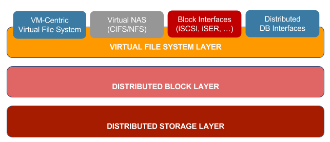

### The Storage Driver
The Storage Driver is the core technology in the Open vStorage technology stack. It is responsible to offer the different [interfaces](Interfaces/README.md) to application and users. To ease the interaction of Administrators this layer can also be accessed through a Virtual File System Layer.

Underneath that file system there is a [Distributed Block Layer](Blocklayer/README.md) which is responsible for the performance, unlimited snapshots, the auto-tiering and the unlimited scalability.

The data coming out of the Distributed Block layer stored into a Distributed Storage Layer. This can be an S3 compatible Object Storage solution or [ALBA](../ALBA/README.md), a storage backend designed and optimized to be used with Open vStorage.

The Volume Driver can be managed through the internal [Volume Driver Python API](pythonapi.md) and generates [Volume Driver Events](events.md).
