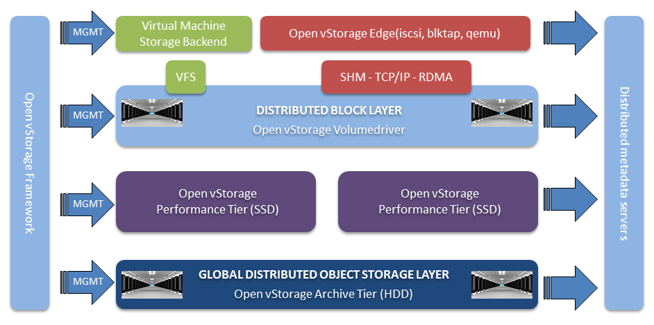

# Open vStorage Architecture
## Introduction

### A birds eye view

The setup consists of the following components:
*The Open vStorage Edge: a light weight block driver which can be installed on Linux hosts.
* The Volume Driver: the core of Open VStorage which converts the block storage into object storage. The Volume Driver keeps track of the volume metadata and implements a log structured write buffer on SSD or in RAM.
* The ALBA performance Tier: an all flash performance tier based upon the Open vStorage backend, ALBA.

