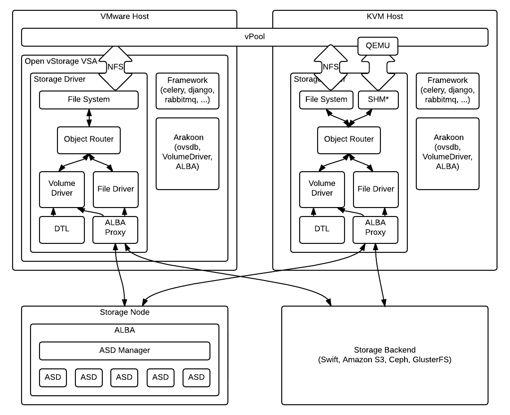

# Open vStorage Architecture
## Introduction
Open vStorage consist out of different components which all are essential and have to work together.

## A birds eye view
From a 1000-feet perspective Open vStorage consist out of 5 big components

The setup consists of the following components:
* The Open vStorage Edge: a light weight block driver which can be installed on Linux hosts.
* The Volume Driver: the core of Open VStorage which converts the block storage into object storage. The Volume Driver keeps track of the volume metadata and implements a log structured write buffer on SSD or in RAM.
* The ALBA performance Tier: an all flash performance tier based upon the Open vStorage backend, ALBA.
* The ALBA capacity Tier: an all HDD tier which stores data safely  across multiple datacenters.
* The Framework: the management framework which servers the GUI and API and manages the scheduled tasks.
* The Distributed Metadata servers: the metadata of the volumes and ALBA backends.

## Detailed view
In the below graphic you can find a detailed schematic of the Open vStorage architecture and the different components.

### Storage Router
The Storage Router is a host running the Open vStorage software. Next, it is important to note that there is a difference between KVM and VMware ESXi. In case of VMware, Open vStorage runs in a VM as a Virtual Storage Appliance (VSA). Basically in that case the Storage Router is the VSA. In case of KVM, Open VStorage runs 'bare metal' next to KVM in the kernel. The complete KVM host is in that case a Storage Router.

The core Store Router technology consists out of 6 components:
* The Object Router
* The Volume Driver
* The File Driver
* The Distributed Transaction Log (DTL)
* The ALBA Proxy
* The Shared Memory server (SHM)

#### The Object Router
On ESXi the Open vStorage vPool the Storage Driver exposes a file system over NFSv3 to the ESXi host as VMware Datastore. When you create a VM or basically files in the Datastore, these files end up on the file system of the VSA of the host where the VM is created. Whenever a file is created, the Object Router detects this events and updates the file system metadata in [Arakoon](../Arakoon/README.md), the distributed key/value database used in Open vStorage. The complete file system get stored in this Arakoon cluster named Volume Driver. This means that as soon as teh distributed DB is updated, all Storage Router who serve that vPool will display these new files in their file system interface. This means the different hosts believe they are using shared storage, but in reality only the metadata of the vPool is shared between all hosts and not the actual data.
Under normal circumstances a file, f.e. a disk of a Virtual Machine, can be seen by all hosts in the Open vStorage Cluster as it is a file on the vPool but the underlying, the internally that file is owned by a single host and can only be accessed by this single host. To keep track of which host is ‘owning’ the file and hence can access the data, the Object Router uses an Object Registry which is implemented on top of the same Distributed Volume Driver DB.

For each write the Object Router will check if it is the owner of the file on the Datastore. In case the Object Router is the owner of the file it will hand off the data to underlying File or Volume Driver on the same Storage Router. Otherwise the Object Router will check in the Object Registry, stored in the distributed database, which Object Router owns the file and forwards the data to that Object Router. The same process is followed for read requests.

#### The Volume Driver
All the read and write requests for an actual volume (a flat-VMDK or raw file) are handled by the Volume Driver. This component is responsible for turning a Storage Backend into a block device. This is also the component which takes care of all the caching. Data which is no longer needed is sent to the backend to make room for new data in the cache. In case data is not in the cache but requested by the Virtual Machine, the Volume Driver will get the needed data from the backend. Note that a single volume is represented by a single namespace on the Storage Backend. It is important to see that only 1 Volume Driver will do the communication with the Storage Backend for a single volume.

#### The File Driver
The File Driver is responsible for all non volume files (vm config files, …). The File Driver stores the actual content of these files on the Storage Backend. Each small file is represented by a single file or key/value pair on the Storage Backend. In case a file is bigger than 1MB, it is split in smaller pieces to improve performance. All the non-volume files for a single Datastore end up in a single, shared bucket. It is important to see that only 1 File Driver will do the communication with the Storage Backend for a file in the Datastore.

#### The Distributed Transaction Log
The DTL is a process which ensures data of a volume in the write buffer isn’t lost when a host crashes. To achieve this incoming writes are also stored in the Distributed Transaction Log (DTL)on another host in the Open vStorage cluster. Hence the DTL contains the outstanding writes, we  call it transactions, of that volume.

#### The ALBA Proxy
The ALBA proxy sits between the Storage Driver and the ALBA backend. It runs as a process on the Storage Router host and takes the data coming from the Volume & File Driver and stores it according to a policy on the different ASDs of the backend.

#### The Shared Memory server (SHM)
On KVM, it is possible to use [QEMU](http://wiki.qemu.org/Main_Page) to deliver storage to Virtual Machines. In that case QEMU talks to a Shared Memory server to optimize the performance. More info on the shared memory implementation can be found [here](../StorageDriver/Blocklayer/shm.md)

### Framework
The Open vStorage Framework takes care of the communication between the different hosts in the Open vStorage cluster and the storage backends. The Framework allows to manage Open vStorage through an intuitive GUI and a complete REST API. It uses various components such as [Celery](https://github.com/celery/celery), [Django](https://github.com/django/django), [RabbitMQ](https://github.com/celery/librabbitmq), [Memcached](https://github.com/memcached/memcached) and many more. More info on Framework can be found [here](../Framework/README.md).

### Arakoon
Arakoon is the distributed key-value store used in Open vStorage. More info on Arakoon can be found [here](https://openvstorage.gitbooks.io/arakoon/content/).

#### Where is Arakoon used in Open vStorage?
Arakoon is as database for various components of the Open vStorage cluster.
* The cluster config: Open vStorage uses a distributed configuration management system. The config values are stored in Arakoon (`arakoon_cacc`).
* The [Framework](https://github.com/openvstorage/framework) model is stored in the DB named **ovsdb**. It stores the details or Storage Routers, vDisks, vMachine, vPools.
* The [Volume Driver](https://github.com/openvstorage/volumedriver) model is stored in the DB named **voldrv**. It stores the Volume Driver cluster config, the metadata of the File System (mapping from /path/to/file -> object ID (volumedriver or filedriver object) exposed by the Volume Driver, the Object Registry - the location of objects in the cluster (which VolumeDriver in the cluster runs "owns" the file/volume), the family tree of a volume (clone-parent relation), replication , distributed locking and scrub management.
* The metadata of the [ALBA backend](https://github.com/openvstorage/alba) are stored in a ABM DB and multiple NSM DBs. The NSM DBs (NameSpace Manager DBs) contain the meta of each stored fragment (ASD, manifest). A single NSM DB can contain data for different namespaces (volumes). The ABM DB (ALBA Manager) contains which NSM DB contains the metadata for which namespace/volume.

### vDisks, vMachines, vPools and Backends
et's start from the bottom, the physical layer, and work up to the virtual layer. For the sake of simplicity we assume a host has one or more SATA drives. With the hyper-converged version (openvstorage-hc) you can unlock functionality to manage these drives and assign them to a Backend. Basically a Backend is nothing more than a collection of physical disks grouped together. These disks can even be spread across multiple hosts. The implementation even gives you the freedom to assign some physical disks in a host to one Backend and the other disks to a second Backend. The only limitation is that a disk can only be assigned to a single Backend at the same time. The benefit of having this Backend concept allows to separate customers even on physical disk level by assigning each of them its own set of hard drives.

On top of a Backend you create one more vPools. You could compare this with creating a LUN on a traditional SAN. The benefit of having the split between a Backend and a vPool allows to have additional flexibility:
* You can assign a vPool per customer or per department. This means you can for example bill per used GB.
* You can set a different encryption passphrase per vPool.
* You can enable or disable compression per vPool.
* You can set the resilience factor per vPool. For example a “test” vPool, where you store only a single copy of the Storage Container Objects (SCOs) but for production servers you can configure 3-way replication.

On top of the vPool, configured as a Datastore in VMware or a mountpoint in KVM, you can create vMachines. Each vMachine can have multiple vDisks, Virtual disks. For now vmdk and raw files are supported.