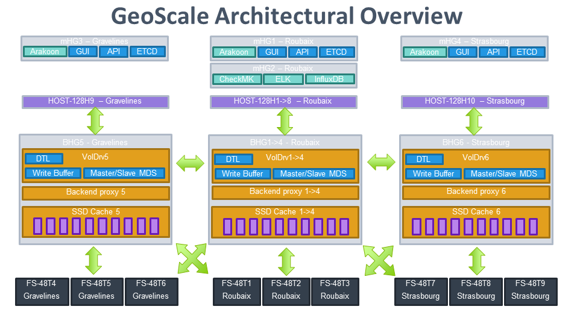

# Open vStorage Cluster Topology
## Introduction
Setting up a large Open vStorage cluster across multiple datacenters can be quite challenging to do. This section provides a description of the topology for a multi-site Open vStorage cluster.

### The hardware
As a reference this example uses 3 datacenters (Roubaix, Gravelines, Strasbourg). Inside each of the datacenters there are 4 types of nodes
* Compute hosts: these hosts run the Virtual Machines.
* Storage Driver nodes: these hosts run the Storage Routers. They are equipped with SSDs which act as local cache layer within the datacenter.
* Capacity nodes: these hosts, across all the datacenters, form the capacity tier. They are equipped with SATA drives.
* Management (Controller) nodes: these nodes run the master services, the GUI, the API, distributed databases, the scrubbing process and the monitoring.

As an example configs based on the offering of [OVH](https://www.ovh.com/fr/) can be found below:
* Compute nodes (HOST-128H): D-1540(x1), 128GB,	10 GbE, Intel S3K 480GB(x2)
* Storage Driver (BHG-1): E5-2660v3(x2), 512GB, 10 GbE, LSI SAS 9271, Intel S3K 480GB(x12)
* Capacity (FS-48T): E5-2620v3(6c/12t))(x1), 64GB, 10 GbE, 12 x 4TB
* Management nodes (mHG): E5-2630v3(x1), 64GB, 10 GbE, Intel S3K 800GB(x2)

### Cluster Topology
The below picture explains the topology or our example cluster:
* In the Roubaix datacenter (the main datacenter)
    * 2 Management node (1 for the distributed DB, 1 for [monitoring](https://github.com/openvstorage/openvstorage-monitoring))
    * 8 Compute nodes
    * 4 Storage Driver nodes
    * 3 Capacity nodes
* In the Gravelines datacenter
    * 1 Management nodes
    * 1 Compute node
    * 1 Storage Driver node
    * 3 Capacity nodes
* In the Strasbourg datacenter
    * 1 Management node
    * 1 Compute node
    * 1 Storage Router node
    * 3 Capacity nodes

Next to the different node types, there are also different roles in Open vStorage. Each node has one ore more roles assigned.
* Edge role: runs the edge role, a lightweight block device.
* Volume Driver role: runs the volume driver and Write Buffer component.
* Controller role: runs the API, GUI, memcache, RabbitMQ and Framework DBs. This role can only be assigned to nodes which already have Volumed Driver role assigned. 
* Storage role: runs the ASD manager. the disks of these nodes can be use as ASD in a backend.

In the example cluster the roles are distributed as followed:
* One management node in each datacenter has the controller role assigned. 
* The compute nodes, which are running the KVM hypervisor, have the edge role assigned.
* The Storage Driver nodes have the Volume Driver and storage role assigned.
* The capacity nodes have only the storage role assigned.

The cluster consist out of multiple ALBA backends:
* A *local performance backend* using the SSDs of the Performance nodes. Each datacenter has its own local performance backend. All SSDs in a single datacenter are grouped to form a single, global cache. In the Roubaix datacenter a 9+3 policy is used so a loss of a performance node can be survived without losing the complete cache. The backend is configured as ALBA cache for the global backend.
* A *local capacity backend* using the SATA disks of the Capacity nodes.  Recovery from a disk failure should be possible without the need to fetch data from other datacenters so a (5,4,8,3) policy is used.
* A *global backend* which consists out of the 3 local capacity backends. A policy of (2,1,2,1) used in this case to protect against a datacenter failure.

**NOTE:** A policy consist out of 4 numbers labaled as (k,m,c,x):
* k: Each Storage Container Object (SCO) gets  split into k fragments, the data fragments. 
* m: Next to the data framents (k), m additional paraity fragments will be created. Upto m fragments can be lost before any dataloss occurs.
* c: The amount of fragments that must be acknowledged by the backends before the SCO is marked as safely stored on the backend. For datasafety reasons k <= c <= (k + m). 
* x: The maximal amount of fragments per ASD node. This setting avoids hotspots where all fragments end up on the same ASD node.

The cluster has 1 vPool which is spread across the 3 datacenters. This means that VMs can be moved and started in any of the 3 datacenters. The vPool will consist out of 6 Storage Routers, one on each performance node (4 in Roubaix, 1 in Gravelines and 1 in Strasbourg).
Due to the high latency between the sites, the DTL for volumes in the Roubaix datacenter are configured to be in the Roubaix datacenters. Since the Gravelines and Strasbourg datacenter only have a singe performance node, the DTL for volumes in these datacenters is hosted in Roubaix.
The compute nodes run the Edge client which connect over the network with the the performance nodes.

Each of the datacenters has a management node running the GUI, the API and the distributed database. In the Roubaix datacenter an additional management node is installed which hosts the monitoring components (statistics-InfluxDB/Grafana, logs-ELK/Kibana) and check_MK for events and alerting.

The cluster has 3 domains: Gravelines, Roubaix and Strasbourg. Since the cluster is relatively small no additional tags are required to split up per rack or powerfeed.

